> Supplemental, unverified input, retained for provenance. This is the entry
> document of the Pathfinder duplication and architecture audit; it is not a
> binding record. Its claims were re-verified in
> [`../../2026-09-17-gemini-audit-adversarial-review.md`](../../2026-09-17-gemini-audit-adversarial-review.md),
> whose ledger carries a verdict per claim under the `DE-` and `ADR-` refs.
> Refuted there: DE-05 (two copies of the block numbering), ADR-01 (the
> 14-parameter maximum) and ADR-03 (the migration-17 guard).

# CAOS v2 — Feature Inventory & Architectural Boundaries

**Date:** 2026-09-15
**Codebase:** `/Users/ericguei/Documents/caos-workbench`
**Phase:** Phase 0 Feature Discovery

---

## Executive Overview

CAOS v2 turns governed source documents into committee-ready credit conclusions for institutional leveraged-finance analysts. The system is architected around 11 strict domain invariants, including immutable bundle authority, pure route resolution, coordinate-anchored citations, transactional pairing, and fail-closed budgets.

The codebase is partitioned into **9 non-overlapping architectural features**, spanning the backend ASGI server, background worker runtime, evidence pipelines, financial calculators, governance layer, benchmark harness, and the single-screen browser workspace.

---

## Feature Inventory

### Feature 1: Edge Authentication & API Gateway
- **Purpose:** Outer network boundary and HTTP gateway. Enforces loopback address restrictions, bearer token authentication (`CAOS_DEV_USER`), request hygiene, CORS origin checks, strict wire models (`extra="forbid"`), health monitoring, and real-time Server-Sent Events (SSE) streaming of case events (`/api/v1/cases/{case_id}/events`).
- **Entry Points:**
  - `server/api/site.py:122` (`application: ASGIApp = EdgeGuard(dispatch)`)
  - `server/api/site.py:98` (`async def dispatch(...)`)
  - `server/api/app.py:192` (`app = FastAPI(...)`)
  - `server/api/app.py:277` (`read_case_events`)
  - `server/api/edge.py:150` (`class EdgeGuard`)
  - `server/api/health.py:73` (`read_health`)
- **Core Files:**
  - `server/api/site.py:1-123`
  - `server/api/app.py:1-339`
  - `server/api/edge.py:1-335`
  - `server/api/identity.py:1-155`
  - `server/api/deps.py:1-137`
  - `server/api/stream.py:1-208`
  - `server/api/health.py:1-197`
  - `server/api/wire.py:1-739`
  - `server/refusals.py:1-218`
- **Interactions:**
  - Receives HTTP/SSE requests from Frontend Client (`frontend/src/app/transport.ts:162`, `frontend/src/app/sse.ts:15`).
  - Dispatches to Ingestion, Case/Run Management, and Deliverable read routers.
  - Streams real-time run and audit transitions from PostgreSQL via `server/store/events.py`.

---

### Feature 2: Evidence Ingestion & Citation Anchoring
- **Purpose:** Fail-closed document ingestion (whole-or-none pack admittance, PDF extraction, token coordinate extraction, layout blocks) and coordinate-anchored citation verification. Locates quotes in the token index, computes QuadPoint rectangles, and ensures evidence reads fail closed.
- **Entry Points:**
  - `server/api/commands/cases.py:133` (`admit_sources_command`)
  - `server/evidence/ingest.py:116` (`prepare_pack`)
  - `server/evidence/ingest.py:164` (`admit_prepared`)
  - `server/evidence/ingest.py:98` (`admit_pack`)
  - `server/evidence/read.py:118` (`read_evidence`)
  - `server/evidence/citations.py:161` (`verify_citations`)
  - `server/api/reads/evidence.py:35` (`read_page`)
  - `server/api/reads/upload.py:35` (`read_upload`)
- **Core Files:**
  - `server/evidence/ingest.py:1-411`
  - `server/evidence/extract.py:1-255`
  - `server/evidence/pdf.py:1-550`
  - `server/evidence/page.py:1-260`
  - `server/evidence/read.py:1-139`
  - `server/evidence/citations.py:1-288`
  - `server/api/commands/cases.py:133-271`
  - `server/api/reads/evidence.py:1-98`
  - `server/api/reads/upload.py:1-105`
- **Interactions:**
  - Stores raw PDF bytes in content-addressed storage (`server/blobs.py:47`).
  - Writes metadata to `sources`, `source_blocks`, and `source_tokens` in PostgreSQL (`server/store/__init__.py`).
  - Feeds verified text blocks to Execution Engine and Methodology (`server/evidence/read.py:118`).
  - Serves page images and bounding boxes to Frontend Evidence Drawers (`frontend/src/evidence/EvidenceDrawer.tsx:34`).

---

### Feature 3: Case & Run Management, Route Resolution & Gate Planning
- **Purpose:** Case registration, pure topological route resolution across typed dependency edges, immutable route and subject input pinning, and gate preview/approval (Source Set gate and Research Plan gate).
- **Entry Points:**
  - `server/api/commands/cases.py:92` (`create_case_command`)
  - `server/api/commands/runs.py:104` (`create_run_command`)
  - `server/api/commands/runs.py:157` (`pin_input_command`)
  - `server/api/commands/runs.py:214` (`preview_gate_command`)
  - `server/api/commands/runs.py:269` (`approve_gate_command`)
  - `server/engine/route.py:168` (`resolve_route`)
  - `server/store/routes.py:53` (`pin_route_in`)
  - `server/api/reads/directory.py:35` (`read_directory`)
  - `server/api/reads/run.py:73` (`read_run`)
- **Core Files:**
  - `server/api/commands/cases.py:1-132`
  - `server/api/commands/runs.py:1-323`
  - `server/api/commands/availability.py:1-138`
  - `server/api/commands/_request.py:1-148`
  - `server/engine/route.py:1-548`
  - `server/store/routes.py:1-218`
  - `server/store/run_inputs.py:1-352`
  - `server/store/gates.py:1-348`
  - `server/store/source_sets.py:1-285`
  - `server/api/reads/directory.py:1-73`
  - `server/api/reads/run.py:1-395`
- **Interactions:**
  - Uses route skills defined by Methodology bundle (`server/methodology/bundle.py`).
  - Writes immutable route topology, input pins, and audit records into Storage & Governance (`server/store/routes.py`, `server/store/audit.py`).
  - Enqueues verified runs for background processing in Execution Engine (`server/store/work.py:35`).
  - Supplies directory listings and route DAG visual data to Frontend Run Section (`frontend/src/sections/run/RunSection.tsx:87`).

---

### Feature 4: Execution Engine & Worker Runtime
- **Purpose:** Asynchronous, crash-durable execution runtime. Drives the topological node frontier from accepted attempts, locks run records, enforces worst-case pre-call budget checks, dispatches LLM calls via OpenRouter, and atomically commits attempt outcomes and spend.
- **Entry Points:**
  - `server/engine/worker.py:200` (`run_worker`)
  - `server/engine/worker.py:115` (`work_once`)
  - `server/engine/runtime.py:128` (`run_route`)
  - `server/api/commands/execution.py:80` (`start_run`)
  - `server/api/commands/execution.py:139` (`retry_run`)
  - `server/api/commands/execution.py:200` (`cancel_run`)
  - `server/provider.py:260` (`OpenRouter.complete`)
  - `server/methodology/runner.py:75` (`ModuleProvider.execute`)
- **Core Files:**
  - `server/engine/worker.py:1-304`
  - `server/engine/runtime.py:1-478`
  - `server/api/commands/execution.py:1-273`
  - `server/provider.py:1-465`
  - `server/pricing.py:1-68`
  - `server/store/work.py:1-222`
  - `server/store/budget.py:1-164`
  - `server/store/outcomes.py:1-356`
  - `server/store/runs.py:1-419`
- **Interactions:**
  - Claims pending work from PostgreSQL `run_work` queue (`server/store/work.py:54`).
  - Calls Methodology and Financial Calculators to generate module prompts and parse envelopes.
  - Verifies module citations against Evidence Ingestion (`server/evidence/citations.py:161`).
  - Atomically commits attempt records, token charges, and lifecycle events to Storage & Governance.

---

### Feature 5: Methodology Bundle, Canonical Validation & Financial Calculators
- **Purpose:** Authority and execution semantics for credit analysis skills. Verifies read-only Deploy V bundle bytes at use, validates Markdown handoffs against strict canonical schemas, and executes deterministic Cash Flow (CP-CF) forecasting using high-precision Decimal arithmetic.
- **Entry Points:**
  - `server/methodology/bundle.py:54` (`Bundle.__post_init__`)
  - `server/methodology/bundle.py:95` (`Bundle.skill_of`)
  - `server/methodology/bundle.py:221` (`assemble_authority`)
  - `server/methodology/canonical.py:161` (`execute_handoff`)
  - `server/methodology/forecast.py:52` (`forecast_projection`)
  - `server/calculators/cash_flow.py:66` (`cash_flow_forecast`)
  - `server/calculators/cash_flow.py:114` (`forecast_bytes`)
  - `server/api/reads/analysis.py:46` (`read_analysis`)
  - `server/api/reads/model.py:40` (`read_model`)
- **Core Files:**
  - `server/methodology/bundle.py:1-380`
  - `server/methodology/canonical.py:1-956`
  - `server/methodology/forecast.py:1-173`
  - `server/methodology/handoff.py:1-648`
  - `server/methodology/invocation.py:1-1055`
  - `server/methodology/runner.py:1-149`
  - `server/methodology/executor.py:1-118`
  - `server/methodology/vendor.py:1-177`
  - `server/methodology/host.py:1-68`
  - `server/calculators/cash_flow.py:1-408`
  - `methodology/skills/` (vendored and host skills)
  - `server/api/reads/analysis.py:1-309`
  - `server/api/reads/model.py:1-96`
- **Interactions:**
  - Loaded by Route Planner (`server/engine/route.py`) to discover registered skills.
  - Invoked by Execution Engine (`server/engine/runtime.py`) during step dispatch.
  - Relies on Evidence Ingestion for citation validation.
  - Delivers structured findings to Analysis and Model sections in Frontend Client.

---

### Feature 6: Deliverable Assembly, Governance & Audit Filing
- **Purpose:** Credit memorandum revision drafting, analyst opinion signing, freeze enforcement, 3-actor independent filing (`APPROVER_NOT_INDEPENDENT`), deterministic HTML deliverable rendering, and detached audit package compilation.
- **Entry Points:**
  - `server/deliverable/revisions.py:93` (`save_revision`)
  - `server/deliverable/filing.py:48` (`sign_opinion`)
  - `server/deliverable/filing.py:71` (`freeze`)
  - `server/deliverable/filing.py:113` (`file_deliverable`)
  - `server/deliverable/render.py:46` (`render`)
  - `server/deliverable/package.py:35` (`audit_package`)
  - `server/deliverable/verify_package.py:65` (`verify_package`)
  - `server/api/reads/reports.py:41` (`read_report`)
  - `server/api/reads/reports.py:56` (`read_committee`)
- **Core Files:**
  - `server/deliverable/render.py:1-249`
  - `server/deliverable/revisions.py:1-188`
  - `server/deliverable/filing.py:1-218`
  - `server/deliverable/canonical.py:1-294`
  - `server/deliverable/receipts.py:1-85`
  - `server/deliverable/package.py:1-61`
  - `server/deliverable/verify_package.py:1-196`
  - `server/api/reads/reports.py:1-212`
- **Interactions:**
  - Aggregates accepted module artifacts from Storage & Governance.
  - Re-checks narrative citations with Evidence Ingestion (`server/evidence/citations.py:161`).
  - Writes revision records, opinion rows, and filing receipts into Storage & Governance.
  - Powers Report and Committee sections in Frontend Client.

---

### Feature 7: Storage, Content-Addressed Blobs & Transactional Governance Core
- **Purpose:** Core relational and blob persistence. Manages PostgreSQL connections, schema migrations (0002-0020), content-addressed SHA-256 storage (`BlobStore`), Unicode `BoundaryText` sanitization, idempotent command execution, atomic state + audit pairing, and hash-chained tamper-evident audit logs.
- **Entry Points:**
  - `server/store/__init__.py:126` (`connect`)
  - `server/store/__init__.py:171` (`apply_schema`)
  - `server/blobs.py:47` (`BlobStore.put`)
  - `server/blobs.py:80` (`BlobStore.get`)
  - `server/store/commands.py:143` (`run_command`)
  - `server/store/audit.py:86` (`governed_write`)
  - `server/store/audit.py:133` (`verify_chain`)
  - `server/store/members.py:63` (`standing_of`)
  - `server/store/events.py:41` (`emit_run_event`)
- **Core Files:**
  - `server/store/__init__.py:1-277`
  - `server/store/schema.sql:1-356`
  - `server/blobs.py:1-125`
  - `server/boundary_text.py:1-55`
  - `server/store/audit.py:1-232`
  - `server/store/commands.py:1-249`
  - `server/store/events.py:1-105`
  - `server/store/members.py:1-137`
  - `server/store/cases.py:1-32`
  - `server/store/extraction_integrity.py:1-108`
- **Interactions:**
  - Underpins all backend features for state storage, immutable locks, audit chains, and event tracking.

---

### Feature 8: Frontend Workspace UI
- **Purpose:** React + Vite + TypeScript single-page application. Renders invariant 4-band chrome (Ribbon, Decision Brief, Section Tabs, Verdict Strip), 9 functional sections (Directory, Upload, Analysis, Book, Run, Model, Report, Committee, Admin), interactive Evidence/Source Drawers, Metric Passports, and handles real-time SSE stream reconnection.
- **Entry Points:**
  - `frontend/src/main.tsx:10` (`createRoot(...).render(...)`)
  - `frontend/src/app/App.tsx:45` (`export function App`)
  - `frontend/src/app/Workspace.tsx:84` (`export function Workspace`)
  - `frontend/src/app/transport.ts:162` (`fetchSection`)
  - `frontend/src/app/commands.ts:80` (`sendCommand`)
  - `frontend/src/evidence/EvidenceDrawer.tsx:34` (`EvidenceDrawer`)
  - `frontend/src/evidence/MetricPassport.tsx:84` (`MetricPassport`)
- **Core Files:**
  - `frontend/src/main.tsx:1-13`
  - `frontend/src/app/App.tsx:1-57`
  - `frontend/src/app/Workspace.tsx:1-253`
  - `frontend/src/app/transport.ts:1-274`
  - `frontend/src/app/commands.ts:1-239`
  - `frontend/src/app/authority.ts:1-177`
  - `frontend/src/app/sections.ts:1-91`
  - `frontend/src/app/sse.ts:1-54`
  - `frontend/src/app/snapshot.ts:1-36`
  - `frontend/src/chrome/Ribbon.tsx:1-74`
  - `frontend/src/chrome/DecisionBrief.tsx:1-24`
  - `frontend/src/chrome/SectionTabs.tsx:1-50`
  - `frontend/src/chrome/VerdictStrip.tsx:1-20`
  - `frontend/src/chrome/Rail.tsx:1-103`
  - `frontend/src/chrome/compose.ts:1-74`
  - `frontend/src/evidence/EvidenceDrawer.tsx:1-109`
  - `frontend/src/evidence/MetricPassport.tsx:1-105`
  - `frontend/src/evidence/SourceDrawer.tsx:1-189`
  - `frontend/src/evidence/CitationChip.tsx:1-38`
  - `frontend/src/sections/directory/DirectorySection.tsx:1-68`
  - `frontend/src/sections/upload/UploadSection.tsx:1-74`
  - `frontend/src/sections/analysis/AnalysisSection.tsx:1-218`
  - `frontend/src/sections/book/BookSection.tsx:1-125`
  - `frontend/src/sections/run/RunSection.tsx:1-278`
  - `frontend/src/sections/model/ModelSection.tsx:1-89`
  - `frontend/src/sections/report/ReportSection.tsx:1-106`
  - `frontend/src/sections/committee/CommitteeSection.tsx:1-150`
  - `frontend/src/sections/admin/AdminSection.tsx:1-24`
- **Interactions:**
  - Communicates with Edge Authentication & API Gateway via strictly typed wire models (`frontend/src/wire/index.ts`).
  - Receives push event stream from Gateway via SSE (`frontend/src/app/sse.ts:15`).
  - Emits idempotent command payloads via `sendCommand` (`frontend/src/app/commands.ts:80`).

---

### Feature 9: Benchmark Qualification & Model Performance Verification
- **Purpose:** End-to-end qualification harness and verification matrix for credit analysis models. Executes complete pipeline runs on test portfolios (`ccl-fy2025`, `vmo2-fy2025`), validates orchestration proofs, and evaluates results against ground truth.
- **Entry Points:**
  - `server/qualification/harness.py:225` (`prepare`)
  - `server/qualification/harness.py:295` (`perform`)
  - `server/qualification/matrix.py:239` (`build_matrix`)
  - `server/qualification/proof.py:102` (`assert_orchestration_proof`)
  - `server/qualification/verdict.py:79` (`read_verdict`)
  - `server/api/reads/qualification.py:35` (`read_qualification`)
- **Core Files:**
  - `server/qualification/harness.py:1-690`
  - `server/qualification/matrix.py:1-512`
  - `server/qualification/proof.py:1-381`
  - `server/qualification/verdict.py:1-177`
  - `server/qualification/on_disk.py:1-305`
  - `server/qualification/store.py:1-368`
  - `server/api/reads/qualification.py:1-92`
  - `qualification/ccl-fy2025/`
  - `qualification/vmo2-fy2025/`
- **Interactions:**
  - Feeds source packs through Evidence Ingestion.
  - Triggers execution routes via Execution Engine.
  - Stores qualification proofs and verdicts in Storage & Governance.
  - Exposes verdict to Frontend UI via `QualificationStrip` in the Ribbon.

---

## Architectural Interaction Diagram

```mermaid
flowchart TD
    subgraph Client["Frontend Client (Browser)"]
        UI["Workspace Shell & 9 Sections<br/>frontend/src/app/Workspace.tsx:84"]
        DRAWER["EvidenceDrawer & MetricPassport<br/>frontend/src/evidence/EvidenceDrawer.tsx:34"]
        CMD_CLIENT["Command Dispatcher<br/>frontend/src/app/commands.ts:80"]
    end

    subgraph Gateway["Edge Auth & API Gateway"]
        EDGE["EdgeGuard Middleware<br/>server/api/edge.py:150"]
        DISPATCH["Site Dispatcher<br/>server/api/site.py:98"]
        FASTAPI["FastAPI App Router<br/>server/api/app.py:192"]
        SSE["Case Events SSE Stream<br/>server/api/app.py:277"]
    end

    subgraph Evidence["Evidence & Citation Layer"]
        INGEST["admit_prepared / prepare_pack<br/>server/evidence/ingest.py:116"]
        READ_EV["read_evidence<br/>server/evidence/read.py:118"]
        CITATIONS["verify_citations (QuadPoints)<br/>server/evidence/citations.py:161"]
    end

    subgraph Management["Case, Run & Route Management"]
        CASE_CMD["create_case_command<br/>server/api/commands/cases.py:92"]
        RUN_CMD["create_run_command<br/>server/api/commands/runs.py:104"]
        RESOLVE["resolve_route (Pure)<br/>server/engine/route.py:168"]
        PIN_ROUTE["pin_route_in<br/>server/store/routes.py:53"]
        GATES["gate_preview / release_gate_in<br/>server/store/gates.py:69"]
    end

    subgraph Execution["Execution Engine & Worker"]
        WORKER["run_worker / work_once<br/>server/engine/worker.py:115"]
        RUNTIME["run_route & Frontier Loop<br/>server/engine/runtime.py:128"]
        PROVIDER["OpenRouter Client & Budget<br/>server/provider.py:260"]
        RUN_EXEC_CMD["start_run / retry_run<br/>server/api/commands/execution.py:80"]
    end

    subgraph Methodology["Methodology & Deterministic Calculators"]
        BUNDLE["Bundle byte verification<br/>server/methodology/bundle.py:54"]
        HANDOFF["validate_markdown & Canonical Record<br/>server/methodology/handoff.py:286"]
        CANONICAL["execute_handoff<br/>server/methodology/canonical.py:161"]
        CF_CALC["cash_flow_forecast (CP-CF)<br/>server/calculators/cash_flow.py:66"]
    end

    subgraph Deliverable["Deliverable Assembly & Audit Filing"]
        REVISION["save_revision<br/>server/deliverable/revisions.py:93"]
        RENDER["render HTML deliverable<br/>server/deliverable/render.py:46"]
        FILING["sign_opinion / freeze / file_deliverable<br/>server/deliverable/filing.py:113"]
        AUDIT_PKG["audit_package & verify_package<br/>server/deliverable/package.py:35"]
    end

    subgraph Qualification["Benchmark Qualification"]
        HARNESS["perform / prepare<br/>server/qualification/harness.py:295"]
        MATRIX["build_matrix<br/>server/qualification/matrix.py:239"]
        PROOF["assert_orchestration_proof<br/>server/qualification/proof.py:102"]
    end

    subgraph Storage["Storage, CAS Blobs & Governance Core"]
        STORE["PostgreSQL & apply_schema<br/>server/store/__init__.py:171"]
        BLOBS["BlobStore put/get<br/>server/blobs.py:47"]
        AUDIT["governed_write & verify_chain<br/>server/store/audit.py:86"]
        EVENTS["emit_run_event & lock_run<br/>server/store/events.py:41"]
        WORK_QUEUE["enqueue_run & claim_run<br/>server/store/work.py:54"]
    end

    %% Client Interactions
    UI -->|"Fetch sections"| DISPATCH
    CMD_CLIENT -->|"POST commands"| DISPATCH
    DISPATCH --> EDGE
    EDGE --> FASTAPI
    FASTAPI --> SSE
    SSE -.->|"SSE updates"| UI
    DRAWER -->|"Read evidence/pages"| FASTAPI

    %% Gateway to Ingestion & Management
    FASTAPI -->|"Admit Pack"| INGEST
    FASTAPI -->|"Create Case"| CASE_CMD
    FASTAPI -->|"Create/Pin Run"| RUN_CMD
    FASTAPI -->|"Start/Retry/Cancel"| RUN_EXEC_CMD

    %% Management Interactions
    CASE_CMD -->|"Audit event & Case row"| AUDIT
    RUN_CMD -->|"Resolve route"| RESOLVE
    RUN_CMD -->|"Pin route"| PIN_ROUTE
    RUN_CMD -->|"Preview/Approve"| GATES
    RESOLVE -->|"Read catalog"| BUNDLE
    RUN_EXEC_CMD -->|"Enqueue work"| WORK_QUEUE

    %% Ingestion Interactions
    INGEST -->|"Save bytes"| BLOBS
    INGEST -->|"Write sources, tokens, blocks"| STORE
    READ_EV -->|"Fetch block text"| STORE
    CITATIONS -->|"Token lookup"| STORE

    %% Execution Engine Interactions
    WORK_QUEUE -->|"Claim lease"| WORKER
    WORKER --> RUNTIME
    RUNTIME -->|"Check authority"| BUNDLE
    RUNTIME -->|"Execute module"| CANONICAL
    CANONICAL -->|"Validate handoff"| HANDOFF
    CANONICAL -->|"Verify citations"| CITATIONS
    CANONICAL -->|"Compute projection"| CF_CALC
    CANONICAL -->|"Call model"| PROVIDER
    PROVIDER -->|"Validate spend"| STORE
    RUNTIME -->|"Record attempt & charge"| STORE
    RUNTIME -->|"Emit transition"| EVENTS

    %% Deliverable Interactions
    FASTAPI -->|"Read report/committee"| REVISION
    REVISION -->|"Assemble artifacts"| STORE
    REVISION -->|"Check figure citations"| CITATIONS
    FILING -->|"Verify signatures & freeze"| AUDIT
    RENDER -->|"Pure render"| BLOBS
    FILING -->|"Save receipt"| AUDIT_PKG

    %% Qualification Interactions
    HARNESS -->|"Admit test pack"| INGEST
    HARNESS -->|"Resolve & Pin"| RESOLVE
    HARNESS -->|"Run route"| RUNTIME
    HARNESS --> MATRIX
    MATRIX --> PROOF
    PROOF -->|"Verify accepted records"| STORE

    %% Storage Core Foundation
    AUDIT --> STORE
    EVENTS --> STORE
    PIN_ROUTE --> STORE
    GATES --> STORE
```

