# Feature 9 Flowchart: Benchmark Qualification & Model Performance Verification

**Date:** 2026-09-15
**Feature:** Benchmark Qualification & Model Performance Verification
**Scope:** Dataset loading, pre-flight budget and measurability checks, test case staging, live/offline pipeline execution, orchestration proof verification (`assert_orchestration_proof`), answer matrix evaluation against ground truth, reviewer verdict binding, and authenticated read views.

---

## 1. Sources Consulted

- `server/qualification/__init__.py:1-38`: `Assurance` enum (`ORCHESTRATION_PROOF`, `QUALIFIED`), architectural boundary between host-asserted proof and reviewer-signed verdict.
- `server/qualification/verdict.py:1-168`: `Verdict` dataclass, `BINDINGS` tuple (6 bindings), `read_verdict` parser and validator, timezone-aware datetime validation, refusal semantics (`VERDICT_INCOMPLETE`, `VERDICT_BINDING_INVALID`, `VERDICT_UNDECLARED_FIELD`, `VERDICT_EXPIRED`).
- `server/qualification/proof.py:1-341`: `OrchestrationProof` dataclass, `assert_orchestration_proof` function, `_CanonicalReader` class, lineage checking, markdown re-validation, citation re-anchoring against live store tokens.
- `server/qualification/matrix.py:1-532`: `QualificationSet`, `QualificationCase`, `ExpectedCitation`, `ExpectedForecast`, `ForecastValue`, `MatrixRow`, `Matrix` dataclasses, `qualification_set_digest`, `build_matrix`, row scoring (`_row`, `_cited`, `_proven`, `_forecast_met`, `_readiness`), `assert_measurable`, `assert_unambiguous`.
- `server/qualification/on_disk.py:1-306`: `load_qualification_set`, manifest parser (`qualification.json`), path traversal prevention (`QUALIFICATION_SET_PATH_ESCAPES`), document ingestion.
- `server/qualification/store.py:1-410`: `Evidence`, `PerformedEvidence`, `performed_evidence`, `record_performed`, `record_evidence`, `evidence_at`, `record_verdict`, `current_verdict`, serialization helpers.
- `server/api/reads/qualification.py:1-95`: `/api/v1/qualification/{evidence_sha256}` GET endpoint, `read_qualification`, role filtering (`RESTRICTED`), state mapping (`QUALIFIED`, `UNQUALIFIED`, `UNAVAILABLE`).
- `qualification/ccl-fy2025/qualification.json:1-36` & `RESULT.md:1-87`: Carnival Corp FY2025 benchmark set (`LITE_CREDIT_22 / LITE_EARNINGS_UPDATE`) and real-world evaluation report on DeepSeek v4 Pro / Terra.
- `qualification/vmo2-fy2025/qualification.json:1-37` & `RESULT.md:1-219`: Virgin Media O2 FY2025 benchmark set and evaluation report on OpenRouter Ionstream.
- `server/store/0018_qualification_verdicts.sql:1-35`: DDL for `qualification_evidence` and `qualification_verdicts` tables and immutability triggers.
- `server/store/0019_one_qualification_verdict.sql:1-5`: Unique constraint `one_verdict_per_evidence` on `qualification_verdicts(evidence_sha256)`.
- `server/store/0020_qualification_performed.sql:1-20`: DDL for `qualification_performed` table and immutability triggers.

---

## 2. Primary Execution Flowchart

```mermaid
flowchart TD
    %% Entry Points & Data Loading
    Start([Start Qualification Run]) --> LoadDisk["load_qualification_set()<br/>server/qualification/on_disk.py:112"]

    subgraph DiskLoading ["1. Dataset Ingestion (Disk I/O)"]
        LoadDisk --> ReadManifest["_manifest()<br/>server/qualification/on_disk.py:125<br/>[Side Effect: Read qualification.json]"]
        ReadManifest --> LoopCases["Iterate cases in manifest<br/>server/qualification/on_disk.py:138"]
        LoopCases --> ReadDocs["_document()<br/>server/qualification/on_disk.py:177<br/>[Side Effect: Read doc bytes & verify path containment]"]
        ReadDocs --> BuildQSet["QualificationSet constructed<br/>server/qualification/matrix.py:136"]
    end

    BuildQSet --> CalcDigest["qualification_set_digest()<br/>server/qualification/matrix.py:169<br/>[Computes canonical SHA-256]"]

    %% Preparation Phase
    CalcDigest --> CallPrepare["prepare()<br/>server/qualification/harness.py:225"]

    subgraph PreparePhase ["2. Harness Preparation (DB Writes & Staging)"]
        CallPrepare --> CheckMeasurable["assert_measurable()<br/>server/qualification/matrix.py:492"]
        CheckMeasurable --> CheckUnambiguous["assert_unambiguous()<br/>server/qualification/matrix.py:519"]
        CheckUnambiguous --> CheckAnswerable["_answerable()<br/>server/qualification/harness.py:675"]
        CheckAnswerable --> CheckAffordable["_affordable()<br/>server/qualification/harness.py:471"]
        CheckAffordable --> CheckSubjects["_subjects()<br/>server/qualification/harness.py:503"]
        CheckSubjects --> CheckIdle["require_idle()<br/>server/store/outcomes.py:95"]

        CheckIdle --> PrepLoop["For each case in QualificationSet<br/>server/qualification/harness.py:264"]
        PrepLoop --> CreateCase["create_case()<br/>server/store/runs.py:98<br/>[Side Effect: DB INSERT into cases]"]
        CreateCase --> AdmitPack["admit_pack()<br/>server/evidence/ingest.py:75<br/>[Side Effect: BlobStore write & DB INSERT docs/sources]"]
        AdmitPack --> StartRun["start_run()<br/>server/store/runs.py:98<br/>[Side Effect: DB INSERT into runs]"]
        StartRun --> PinRoute["pin_route()<br/>server/store/routes.py:96<br/>[Side Effect: DB INSERT into run_routes]"]
        PinRoute --> PinInput["pin_run_input()<br/>server/store/run_inputs.py:97<br/>[Side Effect: DB INSERT into run_inputs]"]
        PinInput --> ReturnPrepared["Return tuple[PreparedCase, ...]<br/>server/qualification/harness.py:292"]
    end

    %% External Gate Approval
    ReturnPrepared --> GateApproval["External Gate Approval<br/>server/store/gates.py:approve_gate<br/>[Side Effect: DB INSERT gate approvals]"]

    %% Execution Phase
    GateApproval --> CallPerform["perform()<br/>server/qualification/harness.py:295"]

    subgraph PerformPhase ["3. Route Execution & Proof"]
        CallPerform --> CheckEligible["_eligible()<br/>server/qualification/harness.py:423<br/>[Verifies pins & document hashes match]"]
        CheckEligible --> LoopExec["For each prepared case<br/>server/qualification/harness.py:347"]

        LoopExec --> ExecRoute["run_route()<br/>server/engine/runtime.py:74<br/>[Side Effect: LLM HTTP calls, DB attempts/artifacts]"]

        ExecRoute --> CheckStopped{"Execution refused?<br/>server/qualification/harness.py:548"}
        CheckStopped -- Yes: Refusal --> RecStopped["Record stopped code & HALT SET<br/>server/qualification/harness.py:350"]

        CheckStopped -- No: Succeeded --> ProofCall["assert_orchestration_proof()<br/>server/qualification/proof.py:102"]

        subgraph HostProof ["Orchestration Proof Verification"]
            ProofCall --> VacuityGuard{"accepted artifacts > 0?<br/>server/qualification/proof.py:124"}
            VacuityGuard -- No --> RefuseVacuous["Refusal: ORCHESTRATION_NOTHING_TO_PROVE<br/>server/qualification/proof.py:125"]
            VacuityGuard -- Yes --> ReaderProven["_CanonicalReader.proven()<br/>server/qualification/proof.py:230<br/>[Side Effect: BlobStore read markdown & record]"]
            ReaderProven --> ReAnchorCitations["verify_citations()<br/>server/evidence/citations.py:53<br/>[Re-anchors quotes against live token index]"]
            ReAnchorCitations --> RetProof["OrchestrationProof returned<br/>server/qualification/proof.py:174"]
        end

        RetProof --> RecordUnrun["_unrun()<br/>server/qualification/harness.py:593"]
        RecordUnrun --> PerformedObj["Performed case returned<br/>server/qualification/harness.py:583"]
        PerformedObj --> LoopExec
    end

    %% Matrix Building Phase
    PerformedObj --> MatrixBranch{"Any case stopped?<br/>server/qualification/harness.py:359"}
    RecStopped --> MatrixBranch
    MatrixBranch -- Yes --> IncompleteSet["matrix = None<br/>server/qualification/harness.py:360"]
    MatrixBranch -- No: All Complete --> BuildMatrix["build_matrix()<br/>server/qualification/matrix.py:239"]

    subgraph MatrixPhase ["4. Matrix Comparison"]
        BuildMatrix --> ScoreRows["_row()<br/>server/qualification/matrix.py:272"]
        ScoreRows --> CompareCitations["_matches()<br/>server/qualification/matrix.py:446<br/>[Compare proof.anchored to expects]"]
        CompareCitations --> CheckForecast{"Case has ExpectedForecast?<br/>server/qualification/matrix.py:326"}
        CheckForecast -- Yes --> EvalForecast["_forecast_met()<br/>server/qualification/matrix.py:316<br/>[Deterministic CP-CF verification]"]
        CheckForecast -- No --> MatrixRet["Matrix object returned<br/>server/qualification/matrix.py:261"]
        EvalForecast --> MatrixRet
    end

    IncompleteSet --> PersistPerf["_persist_performed()<br/>server/qualification/harness.py:375"]
    MatrixRet --> PersistPerf

    subgraph StorePhase ["5. Evidence Persistence (DB Writes)"]
        PersistPerf --> RecPerf["record_performed()<br/>server/qualification/store.py:83<br/>[Side Effect: DB INSERT into qualification_performed]"]
        RecPerf --> RecEvid["record_evidence()<br/>server/qualification/store.py:123<br/>[Side Effect: DB INSERT into qualification_evidence]"]
        RecEvid --> CommitTx["conn.commit()<br/>server/qualification/harness.py:391"]
    end

    %% Reviewer Verdict & Signing Phase
    CommitTx --> ExternalReview["External Analyst/Reviewer Inspection<br/>[Reviews matrix & evidence out-of-band]"]
    ExternalReview --> SignVerdict["read_verdict()<br/>server/qualification/verdict.py:79<br/>[Parses 6 bindings, validates expiry & format]"]
    SignVerdict --> StoreVerdict["record_verdict()<br/>server/qualification/store.py:333<br/>[Side Effect: DB INSERT into qualification_verdicts]"]

    %% API Read Phase
    StoreVerdict --> APIRequest["GET /api/v1/qualification/{evidence_sha256}<br/>server/api/reads/qualification.py:26"]

    subgraph APIReadPhase ["6. Authenticated Read Endpoint"]
        APIRequest --> CheckRole{"actor.role == READER?<br/>server/api/reads/qualification.py:32"}
        CheckRole -- Yes --> RetRestricted["Return state = RESTRICTED<br/>server/api/reads/qualification.py:33"]
        CheckRole -- No --> GetDbNow["SELECT now()<br/>server/api/reads/qualification.py:34"]
        GetDbNow --> LookupEvidence["evidence_at()<br/>server/qualification/store.py:156<br/>[Side Effect: DB SELECT qualification_evidence]"]
        LookupEvidence --> FoundEvid{"Evidence exists?<br/>server/api/reads/qualification.py:39"}
        FoundEvid -- No --> RetUnqualified["Return state = UNQUALIFIED<br/>server/api/reads/qualification.py:40"]
        FoundEvid -- Yes --> CallCurVerdict["current_verdict()<br/>server/qualification/store.py:371<br/>[Side Effect: DB SELECT qualification_verdicts]"]
        CallCurVerdict --> VerdictValid{"Valid & non-expired?<br/>server/api/reads/qualification.py:43"}
        VerdictValid -- Expired / Incomplete --> RetUnqualWithEvid["Return state = UNQUALIFIED<br/>server/api/reads/qualification.py:51"]
        VerdictValid -- Invalid Binding --> RetUnavailable["Return state = UNAVAILABLE<br/>server/api/reads/qualification.py:49"]
        VerdictValid -- Valid --> RetQualified["Return state = QUALIFIED<br/>server/api/reads/qualification.py:52"]
    end

    RetRestricted --> TerminalState([Terminal State: Wire Response Delivered])
    RetUnqualified --> TerminalState
    RetUnqualWithEvid --> TerminalState
    RetUnavailable --> TerminalState
    RetQualified --> TerminalState
```

---

## 3. External Dependencies

1. **Blob Storage Subsystem**:
   - `server.blobs.BlobStore`: storing document bytes (`admit_pack`), reading artifact markdowns and stored JSON records during orchestration proof re-anchoring (`_CanonicalReader.proven`).
2. **Execution Runtime Subsystem**:
   - `server.engine.route.resolve_route`: resolving module DAGs from catalogs and profile/selection IDs.
   - `server.engine.runtime.run_route`: executing route nodes through attempt loops and reservations.
   - `server.methodology.runner.ModuleProvider`: dispatching module invocations with completions and bundle context.
3. **Evidence Ingestion & Citation Indexing**:
   - `server.evidence.ingest.admit_pack`: packing raw documents into a case.
   - `server.evidence.citations.verify_citations`: verifying and anchoring quotes into tokenized source rectangles.
4. **Methodology Bundle & Canonical Verification**:
   - `server.methodology.bundle.Bundle`, `verified_bytes`: accessing pinned skills and manifests.
   - `server.methodology.handoff.read_record`, `validate_markdown`: validating canonical markdown structure, front matter, headers, registers, and projections.
   - `server.methodology.forecast.forecast_projection`: re-computing CP-CF cash-flow statement values from markdown.
   - `server.methodology.invocation.host_identity`, `call_time_identity`, `record_authority_matches`, `accepted_lineage`: validating execution identities against the database ledger.
5. **Store & Governed State**:
   - `server.store.StoreConnection`: connection management, transactional reads/writes.
   - `server.store.routes.pin_route`, `resolved_route`: persisting and querying route pins.
   - `server.store.run_inputs.pin_run_input`, `load_run_input`: persisting and checking run input pins.
   - `server.store.budget.validate_spend`, `worst_case`: ceiling enforcement and pricing arithmetic.
   - `server.store.gates.approve_gate`, `execution_input`: gating execution on explicit approver authorization.
6. **Provider & Network Infrastructure**:
   - `server.provider.CompletionProvider`, `OpenRouter`: network communication with model endpoints.
7. **FastAPI Transport**:
   - `server.api.deps.Caller`, `Store`, `server.api.identity.GlobalRole`, `server.api.wire.QualificationRead`.
