# Feature 3 Flowchart: Case & Run Management, Route Resolution & Gate Planning

**Date:** 2026-09-15
**Feature:** Case & Run Management, Route Resolution & Gate Planning
**Scope:** Case creation, directory views, pure DAG route resolution, route/input pinning, immutable source set snapshotting, gate preview, digest-bound gate approval, and run section inspection.

---

## 1. Sources Consulted

- `server/api/commands/cases.py:1-140`: `create_case_command`, `_open_case`, `_require_global_writer`.
- `server/api/commands/runs.py:1-323`: `create_run`, `pin_input`, `read_gate_preview`, `approve`, `path_gate`, `_owned_run`, `_catalog`.
- `server/api/commands/availability.py:1-138`: `directory_actions`, `upload_actions`, `run_actions`, `_run_checks`, `RunFacts`.
- `server/engine/route.py:1-548`: `resolve_route`, `dependency_order`, `node_states`, `frontier`, `waiting_on`, `route_digest`, `readiness_from`, `_state_for`.
- `server/store/routes.py:1-230`: `pin_route`, `pin_route_in`, `pinned_route`, `resolved_route`, `_canonical`.
- `server/store/run_inputs.py:1-370`: `valid_subject`, `cos_run_id`, `load_run_input`, `pin_run_input`, `pin_run_input_in`.
- `server/store/gates.py:1-294`: `gate_preview`, `_historical_preview`, `sources_live`, `_sources_live`, `approve_gate`, `release_gate_in`, `gate_state`, `approved_run_input`, `execution_input`, `require_adapter_route`.
- `server/store/source_sets.py:1-288`: `load_source_set`, `snapshot_source_set`, `snapshot_in`, `pinned_live_sources`, `case_sources`.
- `server/api/reads/directory.py:1-74`: `read_directory`.
- `server/api/reads/run.py:1-398`: `read_run_section`, `_visible_case`, `_run_view`, `_node_views`.

---

## 2. Primary Execution Flowchart

```mermaid
flowchart TD
    %% Case Creation Subflow
    subgraph Case_Creation ["Case Creation (POST /api/v1/cases)"]
        A1["Client POST /api/v1/cases<br/>cases.py:91"] --> A2["_require_global_writer<br/>cases.py:84"]
        A2 -- Reader role --> A2_Err["Refusal: NOT_AUTHORISED<br/>cases.py:87"]
        A2 -- Writer/Admin role --> A3["run_command(CREATE_CASE)<br/>commands.py:60"]
        A3 --> A4["_open_case prepare hook<br/>cases.py:126"]
        A4 -->|Side Effect: DB INSERT| A5["INSERT cases & grant ADMIN in case_members<br/>cases.py:133-136"]
        A5 -->|Side Effect: DB INSERT| A6["Governed write: CASE_CREATED & Receipt<br/>commands.py:180"]
        A6 --> A7["Return 201 CaseCreated<br/>cases.py:123"]
    end

    %% Directory Subflow
    subgraph Directory_Read ["Directory Read (GET /api/v1/directory)"]
        B1["Client GET /api/v1/directory<br/>directory.py:35"] --> B2["cases_for_member<br/>members.py:25"]
        B2 --> B3["directory_actions<br/>availability.py:43"]
        B3 --> B4["Return DirectoryDocument<br/>directory.py:42"]
    end
    A7 -.-> B1

    %% Run Creation & Route Resolution
    subgraph Run_Creation ["Run Creation (POST /api/v1/cases/{case_id}/runs)"]
        C1["Client POST /api/v1/cases/{case_id}/runs<br/>runs.py:128"] --> C2["require_case_writer<br/>_request.py:43"]
        C2 --> C3{"In ADAPTER_ROUTES?<br/>runs.py:144"}
        C3 -- No --> C3_Err["Refusal: ROUTE_NOT_ENABLED<br/>runs.py:145"]
        C3 -- Yes --> C4["_catalog (verify bundle bytes)<br/>runs.py:118"]
        C4 --> C5["resolve_route<br/>route.py:168"]
        C5 --> C6["dependency_order (topological sort)<br/>route.py:225"]
        C6 --> C7["require_adapter_route<br/>gates.py:281"]
        C7 --> C8["run_command(CREATE_RUN)<br/>commands.py:60"]
        C8 -->|Side Effect: DB lock & INSERT| C9["start_run (status=RUNNING)<br/>runs.py:56"]
        C9 --> C10["pin_route_in<br/>routes.py:53"]
        C10 -->|Side Effect: DB lock, INSERT, APPEND| C11["INSERT run_routes & APPEND RunEvent.ROUTE_PINNED<br/>routes.py:73-84"]
        C11 -->|Side Effect: DB INSERT| C12["Governed write: RUN_CREATED & Receipt<br/>runs.py:163"]
        C12 --> C13["Return 201 RunCreated<br/>runs.py:153"]
    end
    A7 --> C1

    %% Input Pinning Subflow
    subgraph Input_Pinning ["Input Pinning (POST /api/v1/cases/{case_id}/runs/{run_id}/input)"]
        D1["Client POST .../runs/{run_id}/input<br/>runs.py:175"] --> D2["valid_subject validation<br/>run_inputs.py:103"]
        D2 -- Invalid --> D2_Err["Refusal: REQUEST_INVALID<br/>runs.py:195"]
        D2 -- Valid --> D3["run_command(PIN_RUN_INPUT)<br/>commands.py:60"]
        D3 --> D4["_owned_run & pin check<br/>runs.py:103"]
        D4 -- Already pinned --> D4_Err["Refusal: RUN_INPUT_ALREADY_PINNED<br/>runs.py:199"]
        D4 -- Unpinned --> D5["snapshot_in (case lock)<br/>source_sets.py:130"]
        D5 -->|Side Effect: DB INSERT| D6["INSERT source_set_versions & members<br/>source_sets.py:164-173"]
        D6 --> D7["pin_run_input_in<br/>run_inputs.py:299"]
        D7 -->|Side Effect: DB lock, INSERT, APPEND| D8["INSERT run_inputs & APPEND RunEvent.INPUT_PINNED<br/>run_inputs.py:346-368"]
        D8 -->|Side Effect: DB INSERT| D9["Governed write: RUN_INPUT_PINNED & Receipt<br/>runs.py:220"]
        D9 --> D10["Return 200 RunInputPinned<br/>runs.py:202"]
    end
    C13 --> D1

    %% Gate Preview Subflow
    subgraph Gate_Preview ["Gate Preview (GET .../gates/{gate}/preview)"]
        E1["Client GET .../gates/{gate}/preview<br/>runs.py:232"] --> E2["path_gate validation<br/>runs.py:84"]
        E2 --> E3["_owned_run check<br/>runs.py:103"]
        E3 --> E4["gate_preview / _load_run_input<br/>gates.py:69"]
        E4 --> E5["_historical_preview (canonical JSON & SHA256)<br/>gates.py:82"]
        E5 --> E6["Return GatePreviewDocument<br/>runs.py:253"]
    end
    D10 --> E1

    %% Gate Approval Subflow
    subgraph Gate_Approval ["Gate Approval (POST .../gates/{gate}/approval)"]
        F1["Client POST .../gates/{gate}/approval<br/>runs.py:263"] --> F2["require_case_approver<br/>_request.py:22"]
        F2 --> F3["run_command(APPROVE_GATE)<br/>commands.py:60"]
        F3 --> F4["release_gate_in<br/>gates.py:165"]
        F4 -->|Side Effect: DB lock| F5["lock_run (check status RUNNING)<br/>events.py:30"]
        F5 --> F6["gate_preview (re-derive digests)<br/>gates.py:69"]
        F6 --> F7{"Digests match preview?<br/>gates.py:174"}
        F7 -- Mismatch --> F7_Err["Refusal: GATE_APPROVAL_MISMATCH<br/>gates.py:178"]
        F7 -- Match --> F8{"_sources_live (no withdrawals)?<br/>gates.py:114"}
        F8 -- Withdrawn/Altered --> F8_Err["Refusal: EVIDENCE_NOT_AVAILABLE<br/>gates.py:180"]
        F8 -- Fresh --> F9["UPSERT run_gates<br/>gates.py:181"]
        F9 -->|Side Effect: DB INSERT| F10["Governed write: GATE_RELEASED & Receipt<br/>runs.py:308"]
        F10 --> F11["Return 200 GateApproved<br/>runs.py:289"]
    end
    E6 --> F1

    %% Run Section Inspection & Frontier Evaluation
    subgraph Section_Read ["Run Section Read & Frontier (GET /api/v1/cases/{case_id}/run)"]
        G1["Client GET /api/v1/cases/{case_id}/run?run=<br/>run.py:116"] --> G2["_visible_case<br/>run.py:188"]
        G2 --> G3["_run_view / load_run_input<br/>run.py:238"]
        G3 --> G4["gate_state (evaluates OPEN/RELEASED)<br/>gates.py:198"]
        G4 --> G5["resolved_route (decode graph)<br/>routes.py:94"]
        G5 --> G6["accepted_artifacts (load completed attempts)<br/>runtime.py:59"]
        G6 --> G7["node_states (evaluate COMPLETE/RUNNABLE/RESTRICTED/BLOCKED)<br/>route.py:267"]
        G7 --> G8["readiness_from (extract CP-0 verdicts)<br/>route.py:389"]
        G8 --> G9["waiting_on / lite_object_unmet<br/>route.py:338"]
        G9 --> G10["run_actions (evaluate availability checks)<br/>availability.py:52"]
        G10 --> G11["Return RunSectionDocument<br/>run.py:152"]
    end
    F11 --> G1
```

---

## 3. External Dependencies

1. **Feature 1 / System Infrastructure (Identity, Standing & Request Context)**:
   - `server.api.deps.Caller`: extracts and authenticates caller identity from Bearer token.
   - `server.api.identity.GlobalRole`: checks global user roles (`ADMIN`, `ANALYST`, `READER`).
   - `server.api.commands._request`: `require_case_reader`, `require_case_writer`, `require_case_approver`, `Key`, `json_body`.
   - `server.store.members`: `grant`, `standing_of`, `satisfies`, `cases_for_member`, `Standing`: governs per-case authorization.
2. **System Infrastructure (Command Discipline, Hash Chain Audit & Idempotency)**:
   - `server.store.commands`: `run_command`, `request_digest`, `NIL_SCOPE`, `CommandResult`, `find_receipt`: guarantees single-actor transactions under case locks, idempotency deduplication, and atomic receipt persistence.
   - `server.store.audit`: `GovernedAction`, `governed_write`: records append-only events to the case hash chain.
   - `server.store.cases`: `lock_case`: acquires PostgreSQL `SELECT ... FOR UPDATE` on `cases`.
   - `server.store.events`: `lock_run`, `append`, `RunEvent`: manages row-level locks on `runs` and appends run lifecycle events (`ROUTE_PINNED`, `INPUT_PINNED`).
3. **Feature 5 (Methodology Bundle & Host Adapters)**:
   - `server.methodology.bundle.Bundle`, `verified_bytes`: verifies bundle signatures and extracts catalog JSON.
   - `server.methodology.handoff.ADAPTER_ROUTES`, `ADAPTER_MODULES`: whitelist of profiles and pathways validated for execution.
   - `server.methodology.invocation.named_objects`: parses LITE named-object specifications used by `node_states`.
   - `server.methodology.host.verify_extension`: validates host module extensions (e.g., CP-CF).
4. **Feature 2 (Evidence Ingestion & Source Sets)**:
   - `live_sources` & `source_extractions` database views/tables: queried by `snapshot_in` to construct immutable snapshots, and by `_sources_live` to enforce evidence freshness against withdrawals.
   - `server.evidence.extract.ExtractorIdentity`: verifies extraction provenance on source set members.
5. **Feature 4 (Runtime Engine & Worker)**:
   - `server.engine.runtime.accepted_artifacts`: called by `_node_views` in `run.py` to fetch verified outputs from prior attempts.
   - `server.blobs.BlobStore`: content-addressed blob storage for accepted attempt outputs.
   - `server.store.work.Lease`: checked by `availability.py` when evaluating worker lease and execution state.
