# Feature 6 Flowchart: Deliverable Assembly, Governance & Audit Filing

**Date:** 2026-09-15
**Feature:** Deliverable Assembly, Governance & Audit Filing
**Scope:** Deliverable revision drafting, narrative citation verification, analyst opinion signing, committee freeze, 3-actor independent filing rule (`APPROVER_NOT_INDEPENDENT`), deterministic HTML deliverable rendering, and offline-verifiable ZIP32 audit package bundling.

---

## 1. Sources Consulted

- `server/deliverable/canonical.py:1-279` (Canonical payload assembly, route order traversal, citation re-validation, artifact pair binding, `freeze_canonical`, `verify_frozen`)
- `server/deliverable/revisions.py:1-188` (Revision persistence, `_narrative` span checking, `_derive`, `save_revision`, `read_revision`, `prove_revision`)
- `server/deliverable/filing.py:1-218` (Governance lifecycle, `sign_opinion`, `freeze`, `file_deliverable`, 3-actor rule enforcement, `Receipt` dataclass, `_signatures`, `_frozen`)
- `server/deliverable/render.py:1-249` (Pure deterministic HTML deliverable render, Georgia serif print-first CSS, qualification flags, `canonical_bound`, provenance index)
- `server/deliverable/package.py:1-68` (Deterministic audit package bundling, ZIP32 format, `build_package`, `verify_package`, `write_package`)
- `server/deliverable/verify_package.py:1-181` (Offline stdlib-only verification CLI, archive bounds, 100:1 compression ratio limit, renderer pin verification, byte-identical re-render)
- `server/deliverable/receipts.py:1-93` (`read_filed_receipt`, tamper-evident audit trail verification, receipt re-anchoring, `prove_revision` check)
- `server/deliverable/host.py:1-17` (`render_payload`, mapping `RenderRefused` to host `RefusalCode`)
- `server/api/reads/reports.py:1-212` (`read_report`, `read_committee`, shared `_read`, `_publication`, `_body`, authorization and read locks)
- `server/store/0015_revisions.sql:1-28` (PostgreSQL DDL: `deliverable_revisions` table, immutability trigger, foreign key constraints)
- `server/store/0016_filed_receipts.sql:1-17` (PostgreSQL DDL: `deliverable_receipts` table, immutability trigger)
- `server/store/schema.sql:235-267` (`deliverable_opinions`, `deliverable_publications` tables)

---

## 2. Primary Execution Flowchart

```mermaid
flowchart TD
    classDef startEnd fill:#0f172a,stroke:#38bdf8,stroke-width:2px,color:#f8fafc;
    classDef step fill:#1e293b,stroke:#64748b,stroke-width:1px,color:#f8fafc;
    classDef sideEffect fill:#3b0764,stroke:#c084fc,stroke-width:1px,color:#f8fafc;
    classDef branch fill:#1c1917,stroke:#f59e0b,stroke-width:1px,color:#f8fafc;
    classDef refusal fill:#450a0a,stroke:#ef4444,stroke-width:1px,color:#f8fafc;

    Start([Analyst & Committee Workflow Initiated]):::startEnd

    %% PHASE 1: REVISION CREATION
    subgraph S1 ["1. Deliverable Revision Drafting (save_revision)"]
        A1["save_revision<br/>server/deliverable/revisions.py:93"]:::step
        A2["_derive & canonical_payload<br/>server/deliverable/canonical.py:68"]:::step
        A3["_Reader.proven<br/>server/deliverable/canonical.py:162"]:::step
        A4["verify_citations<br/>server/evidence/citations.py:207"]:::step
        A5["_narrative validate spans<br/>server/deliverable/revisions.py:19"]:::step
        A6["payload_bytes JSON serialize<br/>server/deliverable/canonical.py:61"]:::step
        A7["BlobStore.put(payload)<br/>server/blobs.py:47<br/>[Side Effect: Blob Write]"]:::sideEffect
        A8["governed_write(REVISION_SAVED)<br/>server/store/audit.py:86<br/>[Side Effect: DB INSERT & Audit Event]"]:::sideEffect
    end

    Start --> A1
    A1 --> A2
    A2 --> A3
    A3 --> A4
    A4 --> A5
    A5 --> A6
    A6 --> A7
    A7 --> A8

    %% Refusals for Phase 1
    A2 -.->|Missing Case/Run| R_NF["Refusal: DELIVERABLE_NOT_FOUND<br/>server/deliverable/revisions.py:83"]:::refusal
    A3 -.->|Mismatched Proof| R_MM["Refusal: ARTIFACT_RECORD_MISMATCH<br/>server/deliverable/canonical.py:179"]:::refusal
    A4 -.->|Anchor Failed| R_CIT["Refusal: ARTIFACT_RECORD_MISMATCH<br/>server/deliverable/canonical.py:216"]:::refusal
    A5 -.->|Unreferenced digits| R_FIG["Refusal: NARRATIVE_FIGURE_UNREFERENCED<br/>server/deliverable/revisions.py:42"]:::refusal

    %% PHASE 2: SIGN OPINION
    subgraph S2 ["2. Analyst Opinion Signing (sign_opinion)"]
        B1["sign_opinion (Actor 1: Signer)<br/>server/deliverable/filing.py:48"]:::step
        B2{"_frozen is None?<br/>server/deliverable/filing.py:59"}:::branch
        B3["governed_write(OPINION_SIGNED)<br/>server/store/audit.py:86<br/>[Side Effect: DB INSERT deliverable_opinions & Audit Event]"]:::sideEffect
    end

    A8 --> B1
    B1 --> B2
    B2 -->|Yes| B3
    B2 -.->|Already Frozen| R_AF1["Refusal: DELIVERABLE_ALREADY_FROZEN<br/>server/deliverable/filing.py:60"]:::refusal

    %% PHASE 3: FREEZE
    subgraph S3 ["3. Committee Deliverable Freeze (freeze)"]
        C1["freeze (Actor 2: Freezer)<br/>server/deliverable/filing.py:71"]:::step
        C2{"Freezer not in Signers?<br/>server/deliverable/filing.py:95"}:::branch
        C3["prove_revision re-proof<br/>server/deliverable/revisions.py:152<br/>[Hash Check: re-derived SHA256 == digest]"]:::step
        C4["governed_write(DELIVERABLE_FROZEN)<br/>server/store/audit.py:86<br/>[Side Effect: DB INSERT deliverable_publications & Audit Event]"]:::sideEffect
    end

    B3 --> C1
    C1 --> C2
    C2 -->|Distinct Approver| C3
    C2 -.->|Freezer signed opinion| R_IND1["Refusal: APPROVER_NOT_INDEPENDENT<br/>server/deliverable/filing.py:96"]:::refusal
    C3 --> C4
    C3 -.->|Artifact/Source Moved| R_MOVED1["Refusal: DELIVERABLE_MOVED_SINCE_SIGNING<br/>server/deliverable/filing.py:101"]:::refusal

    %% PHASE 4: FILE DELIVERABLE
    subgraph S4 ["4. Committee Deliverable Filing (file_deliverable)"]
        D1["file_deliverable (Actor 3: Filer)<br/>server/deliverable/filing.py:113"]:::step
        D2{"3-Actor Independence Check<br/>Filer not in {Signers, Freezer}<br/>and Freezer not in Signers?<br/>server/deliverable/filing.py:143"}:::branch
        D3["UPDATE deliverable_publications<br/>server/deliverable/filing.py:145<br/>[Side Effect: DB UPDATE filed_by, filed_at]"]:::sideEffect
        D4["governed_write(DELIVERABLE_FILED)<br/>server/store/audit.py:86<br/>[Side Effect: Audit Event Oplog Link]"]:::sideEffect
        D5["persist hook (after_event)<br/>server/deliverable/filing.py:166<br/>[Side Effect: BlobStore.put(Receipt) & DB INSERT deliverable_receipts]"]:::sideEffect
    end

    C4 --> D1
    D1 --> D2
    D2 -->|All 3 Distinct| D3
    D2 -.->|Signer/Freezer attempts filing| R_IND2["Refusal: APPROVER_NOT_INDEPENDENT<br/>server/deliverable/filing.py:144"]:::refusal
    D3 --> D4
    D4 --> D5
    D3 -.->|Already Filed| R_AFL["Refusal: DELIVERABLE_ALREADY_FILED<br/>server/deliverable/filing.py:151"]:::refusal

    %% PHASE 5: RENDERING & EXPORT
    subgraph S5 ["5. Deterministic HTML Rendering & Export (render)"]
        E1["render(payload)<br/>server/deliverable/render.py:46"]:::step
        E2["canonical_bound verification<br/>server/deliverable/render.py:111<br/>[Hash Check: markdown & record SHA256 pairs]"]:::step
        E3["Deterministic Paper HTML Assembly<br/>server/deliverable/render.py:65<br/>[Inline CSS, QA/Status, Citations, Analysis, Provenance]"]:::step
    end

    D5 --> E1
    E1 --> E2
    E2 -->|Pairs Bound| E3
    E2 -.->|Corrupted Artifact| R_PB["Refusal: DELIVERABLE_PAYLOAD_INVALID<br/>server/deliverable/render.py:57"]:::refusal

    %% PHASE 6: AUDIT PACKAGE PACKING & VERIFICATION
    subgraph S6 ["6. Audit Package Bundling & Verification (package.py & verify_package.py)"]
        F1["build_package(payload, receipt, export)<br/>server/deliverable/package.py:41<br/>[Side Effect: Build Deterministic ZIP32 Buffer]"]:::step
        F2["write_package(path, archive)<br/>server/deliverable/package.py:64<br/>[Side Effect: File I/O exclusive 'xb' creation]"]:::sideEffect
        F3["verify_package / verify(archive)<br/>server/deliverable/verify_package.py:150"]:::step
        F4["_directory & _metadata checks<br/>server/deliverable/verify_package.py:33<br/>[Check: ZIP32 bounds, 5 members, ratio <= 100:1]"]:::step
        F5["_contents checks<br/>server/deliverable/verify_package.py:119<br/>[Check: Payload SHA256, 3 roles, Renderer Pin, Byte-identical Re-render]"]:::step
        F6["Terminal: Verification(verified=True)<br/>server/deliverable/package.py:33"]:::startEnd
    end

    E3 --> F1
    F1 --> F2
    F2 --> F3
    F3 --> F4
    F4 --> F5
    F5 -->|Passed| F6
    F5 -.->|Re-render / Hash Mismatch| R_VER["Verification(verified=False, reason=...)<br/>server/deliverable/package.py:33"]:::refusal

    %% PHASE 7: READ APIS
    subgraph S7 ["7. Read API Routing (server/api/reads/reports.py)"]
        G1["read_report / read_committee<br/>server/api/reads/reports.py:40,55"]:::step
        G2["_read lock_case & check standing<br/>server/api/reads/reports.py:70<br/>[Side Effect: Postgres case lock]"]:::step
        G3{"committee == True?"}:::branch
        G4["prove_revision & return ReportDocument<br/>server/api/reads/reports.py:114"]:::step
        G5["_publication & read_filed_receipt<br/>server/api/reads/reports.py:102,134<br/>[Hash Check: Audit Trail Chain & Head Verification]"]:::step
        G6["Return CommitteeDocument<br/>server/api/reads/reports.py:65"]:::startEnd
    end

    F6 -.->|API Consumers| G1
    G1 --> G2
    G2 --> G3
    G3 -->|No| G4
    G3 -->|Yes| G5
    G5 --> G6
```

---

## 3. External Dependencies

| External Component / Feature | Source File & Line | Purpose & Call Sites |
| :--- | :--- | :--- |
| **Feature 1: Evidence Ingestion** | `server/evidence/citations.py:207` | `verify_citations(conn, delivered, citations)` re-anchors citations into live delivered blocks in `_Reader.proven` (`canonical.py:207`). |
| **Feature 2: Methodology Engine** | `server/methodology/bundle.py:31` | `Bundle`, `verified_bytes`, `load_vendor_contract` verify module catalog and contract rules (`canonical.py:153-154`). |
| **Feature 2: Methodology Engine** | `server/methodology/handoff.py:33` | `read_record`, `validate_markdown` re-evaluate artifact records and Markdown projections against contract schemas (`canonical.py:176,196`). |
| **Feature 2: Methodology Engine** | `server/methodology/invocation.py:34` | `host_identity`, `call_time_identity`, `accepted_lineage`, `record_authority_matches` re-prove module invocation authority (`canonical.py:167-186`). |
| **Feature 2: Methodology Engine** | `server/engine/route.py:29` | `ResolvedRoute`, `RouteNode`, `MODEL_MODULE` define the ordered DAG traversal of accepted artifacts (`canonical.py:93,190`). |
| **Feature 2: Methodology Engine** | `server/methodology/executor.py:32` | `captured_blocks(conn, run_id)` obtains live block text for citation re-anchoring (`canonical.py:105`). |
| **Feature 7: Storage & Blobs** | `server/blobs.py:27` | `BlobStore.get(sha)` and `BlobStore.put(bytes)` manage content-addressed immutable storage of payloads and receipts (`canonical.py`, `revisions.py`, `filing.py`). |
| **Feature 7: Storage & Governance** | `server/store/audit.py:15,86` | `GovernedAction`, `governed_write` guarantee that every state mutation is transactionally paired with a hash-chained audit event (`REVISION_SAVED`, `OPINION_SIGNED`, `DELIVERABLE_FROZEN`, `DELIVERABLE_FILED`). |
| **Feature 7: Storage & Governance** | `server/store/audit.py:18` | `audit_trail`, `verify_chain`, `audit_head`, `_digest_of` verify the tamper-evident audit oplog during receipt reads (`receipts.py:76-86`, `reports.py:165-173`). |
| **Feature 7: Storage & Cases** | `server/store/cases.py:19` | `lock_case(conn, case_id)` serializes concurrent case operations during reads and writes (`reports.py:88`). |
| **Feature 7: Storage & Members** | `server/store/members.py:16,20` | `Standing` (`WRITER`, `APPROVER`), `standing_of`, `satisfies` enforce role permissions (`revisions.py:106`, `filing.py:54,83,124`, `reports.py:84,90`). |
| **Feature 7: Storage & Outcomes** | `server/store/outcomes.py:43` | `execution_reads(conn)` opens read-only isolation units for payload construction (`canonical.py:89`, `reports.py:83`). |
| **Feature 7: Storage & Routes** | `server/store/routes.py:44` | `resolved_route(conn, run_id)` retrieves pinned route nodes (`canonical.py:93`). |
| **Feature 7: Storage & Source Sets**| `server/store/source_sets.py:45` | `pinned_live_sources(conn, run_id)` retrieves active evidence documents pinned to the run (`canonical.py:104`). |
| **API Layer: Wire Schemas** | `server/api/wire.py:13` | `ReportDocument`, `CommitteeDocument` format HTTP responses for frontend consumption (`reports.py:40,55`). |
| **Core Refusals Engine** | `server/refusals.py:17` | `Refusal(RefusalCode)` raises clean, closed, structured refusals across the domain boundary. |
