# Feature 1 Flowchart: Edge Authentication & API Gateway

**Date:** 2026-09-15
**Feature:** Edge Authentication & API Gateway
**Scope:** Edge perimeter defense (`EdgeGuard`), loopback isolation, header hygiene, CSRF/Origin enforcement, static export routing, token identity extraction, FastAPI dependency injection, readiness health probers, and real-time SSE case event streaming (`/api/v1/cases/{case_id}/events`).

---

## 1. Sources Consulted

- `server/api/site.py:1-123`: Outermost ASGI entrypoint, site root detection, workspace path rewrites, static file serving, and dispatch.
- `server/api/edge.py:1-335`: EdgeGuard ASGI middleware, mode resolution, edge token validation, loopback checks, header hygiene, CSRF/Origin enforcement, response security headers, and refusal responses.
- `server/api/app.py:1-339`: FastAPI app configuration, lifespan migration & health prober initialization, global refusal/error handlers, and `GET /api/v1/cases/{case_id}/events` SSE streaming.
- `server/api/identity.py:1-133`: Subject UUID extraction, global role resolution via `x-forwarded-groups` or `x-caos-role` dev bypass, and actor modeling.
- `server/api/deps.py:1-121`: FastAPI dependency injection: `Caller`, `Store`, `Blobs`, `Methodology`, enforcing identity resolution before store connection.
- `server/api/stream.py:1-212`: Case event stream engine: `case_tail`, composite cursor tracking, DB polling loop, standing re-checks, terminal state detection, and keep-alive heartbeats.
- `server/api/health.py:1-227`: Readiness probe background loop, thread-isolated probes for store/bundle/blobs, and cached `GET /api/health` handler.
- `server/api/wire.py:1-945`: Strict Pydantic models with `extra="forbid"`, text/line bounds, `RefusalBody`, and wire contract schema generation.
- `server/refusals.py:1-156`: Canonical `RefusalCode` StrEnum and `Refusal` exception.
- `server/api/events.py:1-89`: Composite `Marker` `{audit_seq}.{run_seq}` parsing and `STREAM_NAMES` event mapping.

---

## 2. Primary Execution Flowchart

```mermaid
flowchart TD
    %% Ingress & EdgeGuard
    A["Incoming ASGI Scope (HTTP/Lifespan)<br/>server/api/site.py:122"] --> B["EdgeGuard.__call__<br/>server/api/edge.py:156"]

    B --> C{"Scope Type?<br/>server/api/edge.py:157"}

    %% Lifespan Flow
    C -- "lifespan" --> LS1["EdgeGuard._lifespan<br/>server/api/edge.py:198"]
    LS1 --> LS2["resolve_mode()<br/>server/api/edge.py:102"]
    LS2 --> LS3["dispatch (lifespan)<br/>server/api/site.py:100"]
    LS3 --> LS4["_site_root & _exported check<br/>server/api/site.py:101-102"]
    LS4 --> LS5["FastAPI app._lifespan<br/>server/api/app.py:167"]
    LS5 --> LS6["apply_schema(conn)<br/>server/api/app.py:180<br/>[DB MIGRATION WRITE]"]
    LS6 --> LS7["health.probe_loop background task<br/>server/api/health.py:188<br/>[ASYNC WORKER]"]

    %% HTTP Flow & Perimeter Checks
    C -- "http" --> D["EdgeGuard._refusal<br/>server/api/edge.py:223"]
    D --> E{"Path == /api/health and GET/HEAD?<br/>server/api/edge.py:226"}

    E -- "Yes (Health Bypass)" --> K["Strip x-caos-edge-token<br/>server/api/edge.py:169"]

    E -- "No" --> F["resolve_mode()<br/>server/api/edge.py:228"]
    F --> G{"EdgeGuard._trusted<br/>server/api/edge.py:244"}

    G -- "Edge Mode: hmac.compare_digest<br/>server/api/edge.py:249" --> H{"_hygienic(headers)<br/>server/api/edge.py:256"}
    G -- "Dev Mode: loopback IP & Host match<br/>server/api/edge.py:250-253" --> H
    G -- "Untrusted" --> ERR_TRUST["Refusal: EDGE_NOT_TRUSTED (403)<br/>server/api/edge.py:234"]

    H -- "Duplicate or lookalike headers" --> ERR_AUTH["Refusal: NOT_AUTHENTICATED (401)<br/>server/api/edge.py:236"]
    H -- "Clean" --> I{"Path is /api/*?<br/>server/api/edge.py:237"}

    I -- "Yes" --> J{"_origin_allowed (CSRF/Sec-Fetch-Site)<br/>server/api/edge.py:272"}
    I -- "No (Static)" --> K

    J -- "Origin mismatch / cross-site" --> ERR_ORIGIN["Refusal: ORIGIN_REFUSED (403)<br/>server/api/edge.py:240"]
    J -- "Origin allowed" --> K

    %% Strip Token & Dispatch
    K --> L["Set caos.edge_guarded = True<br/>server/api/edge.py:174"]
    L --> M["dispatch(scope)<br/>server/api/site.py:98"]

    M --> N{"Path starts with /api/?<br/>server/api/site.py:115"}

    %% Static Route Flow
    N -- "No (/ or static file)" --> S1["_static(scope)<br/>server/api/site.py:80"]
    S1 --> S2{"Method in GET, HEAD?<br/>server/api/site.py:81"}
    S2 -- "No" --> ERR_405["_bare 405 Method Not Allowed<br/>server/api/site.py:82"]
    S2 -- "Yes" --> S3{"Workspace route match?<br/>server/api/site.py:89"}
    S3 -- "Yes" --> S4["Rewrite path to /<br/>server/api/site.py:90"]
    S3 -- "No" --> S5["StaticFiles.call<br/>server/api/site.py:93<br/>[DISK I/O READ]"]
    S4 --> S5

    %% API Route Flow
    N -- "Yes (/api/*)" --> R1["FastAPI app.__call__<br/>server/api/app.py:192"]

    R1 --> R2{"Matched Route?<br/>server/api/app.py:214-216"}

    %% Health Route Flow
    R2 -- "/api/health" --> H1["read_health(request)<br/>server/api/health.py:219"]
    H1 --> H2["_document(app.state.health)<br/>server/api/health.py:195<br/>[IN-MEMORY READ]"]
    H2 --> H3["JSONResponse (200 OK / 503)<br/>server/api/health.py:222"]

    %% SSE Events Stream Route Flow
    R2 -- "/api/v1/cases/{case_id}/events" --> DEP1["Caller: actor_from_request<br/>server/api/deps.py:82"]
    DEP1 --> DEP1_A["actor_from_headers<br/>server/api/identity.py:84"]
    DEP1_A -- "Missing/invalid UUID" --> ERR_ANON["Refusal: NOT_AUTHENTICATED (401)<br/>server/api/identity.py:93"]
    DEP1_A -- "Valid UUID" --> DEP1_B["Extract role from groups or claimed<br/>server/api/identity.py:104-106"]

    DEP1_B --> DEP2["Store: store_connection<br/>server/api/deps.py:57<br/>[POSTGRES CONNECT I/O]"]
    DEP2 --> EV1["read_case_events handler<br/>server/api/app.py:277"]

    EV1 --> EV2["_visible(conn, case_id, run, actor)<br/>server/api/app.py:321<br/>[DB READ STANDING]"]
    EV2 -- "Not satisfied" --> ERR_CASE["Refusal: CASE_NOT_FOUND (404)<br/>server/api/app.py:331"]

    EV2 -- "Satisfied" --> EV3["case_tail generator init<br/>server/api/stream.py:113"]
    EV3 --> EV4["_heads(conn, case_id, run_id)<br/>server/api/stream.py:186<br/>[DB READ AGGREGATE]"]
    EV4 --> EV5["parse_marker(Last-Event-ID, heads)<br/>server/api/stream.py:133"]
    EV5 --> EV6["Yield cursor StreamEvent<br/>server/api/stream.py:138"]

    EV6 --> EV7["case_tail polling loop<br/>server/api/stream.py:140"]
    EV7 --> EV8["_pending: actions_after & _run_events_after<br/>server/api/stream.py:158<br/>[DB READ EVENTS]"]
    EV8 --> EV9["_may_watch standing re-check<br/>server/api/stream.py:180<br/>[DB READ STANDING]"]
    EV9 --> EV10["Yield event / heartbeat<br/>server/api/stream.py:146,155"]
    EV10 --> EV11["_frame formatting (id/event/data)<br/>server/api/app.py:309"]
    EV11 --> EV12["StreamingResponse<br/>server/api/app.py:300<br/>[SSE NETWORK WRITE]"]

    %% Other API Reads & Commands
    R2 -- "Other /api/v1/* routes" --> OT1["Section Reads & Commands<br/>server/api/reads/*, commands/*"]

    %% Outbound Security Pipeline
    H3 --> SEC["_secured response wrapper<br/>server/api/edge.py:290"]
    S5 --> SEC
    EV12 --> SEC
    OT1 --> SEC
    ERR_TRUST --> SEC
    ERR_AUTH --> SEC
    ERR_ORIGIN --> SEC
    ERR_CASE --> SEC
    ERR_ANON --> SEC

    SEC --> OUT["Send to Client with CSP, Nosniff, Strip-Cookie<br/>server/api/edge.py:300-311"]
```

---

## 3. External Dependencies

1. **Feature 7: Data Store, Connection Lifecycle & Migrations**:
   - `server.store.connect`: Establishes raw connection to PostgreSQL via `CAOS_DATABASE_URL` (`server/api/deps.py:40,66`, `server/api/health.py:36,80`).
   - `server.store.apply_schema`: Applies all migrations at startup (`server/api/app.py:77,180`).
   - `server.store.verify_schema`: Validates schema integrity for health probe (`server/api/health.py:36,85`).
2. **Feature 7: RBAC & Case Membership**:
   - `server.store.members.standing_of`: Queries user standing on a case (`server/api/app.py:78,329`, `server/api/stream.py:48,182`).
   - `server.store.members.satisfies`: Asserts required membership level (`Standing.READER`) (`server/api/app.py:78,328`, `server/api/stream.py:48,181`).
3. **Feature 4 & Feature 7: Execution Engine & Audit Event Log**:
   - `server.store.events.RunEvent`: References run event statuses (`RUN_COMPLETE`, `RUN_FAILED`, etc.) to terminate tailing (`server/api/stream.py:47,62`).
   - `server.store.audit.actions_after`: Queries sequential audit log entries after a given cursor (`server/api/stream.py:46,166`).
4. **Feature 7: Blob Storage**:
   - `server.blobs.BlobStore`: Instantiated from `CAOS_BLOB_ROOT` for file operations (`server/api/deps.py:37,79`).
5. **Feature 5: Methodology Bundle & Manifest**:
   - `server.methodology.bundle.Bundle`: Ingests vendored bundle from `vendor/deploy-v` (`server/api/deps.py:38,114`, `server/api/health.py:34,100`).
6. **Feature 2, 3, 5, 6: Section Reads and Governed Commands**:
   - `server.api.reads.*`: Routers for Directory, Upload, Run, Analysis, Model, Qualification, Reports, Evidence (`server/api/app.py:64–71, 203–213`).
   - `server.api.commands.*`: Routers for Cases, Runs, and Execution commands (`server/api/app.py:46–48, 215–216`).
