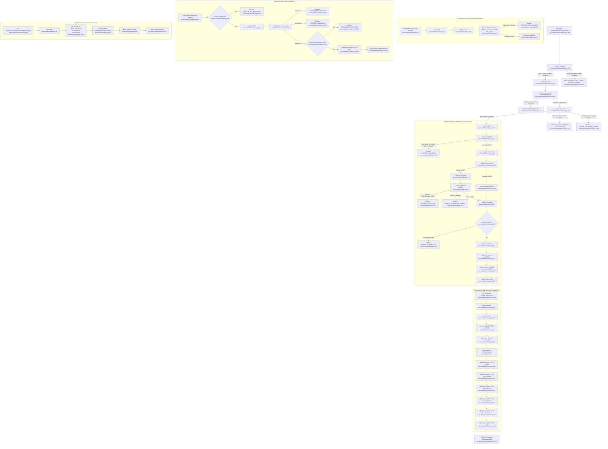

# Feature 2 Flowchart: Evidence Ingestion & Citation Anchoring

**Date:** 2026-09-15
**Feature:** Evidence Ingestion & Citation Anchoring
**Scope:** Document pack preparation, PDF sandboxed parsing, tokenization, content-addressed storage, atomic pack admission, fail-closed block reads, and coordinate-anchored citation verification (Invariant 11).

---

## 1. Sources Consulted

- `server/api/commands/cases.py:84-89, 141-271` — `admit_sources` route handler, `_upload_envelope`, `_admission_documents`, `_bounded`, `_release_read`, `_peek`, and governed `run_command`.
- `server/evidence/ingest.py:1-411` — `admit_pack`, `prepare_pack`, `admit_prepared`, `_check_pack_limits`, `_extract`, `_prepare`, `_digest`, `_admit_one`, `_store_tokens`, `_blocks`, `block_ids_by_line`, `_store_blocks`.
- `server/evidence/extract.py:1-261` — `Token`, `AdmissionLimits`, `DEFAULT_LIMITS`, `ExtractorIdentity`, `Extractor`, `ExtractorDispatch`, `dispatch_by_content`, `PlainTextExtractor`, `_line_tokens`, `_words`.
- `server/evidence/pdf.py:1-525` — `PdfExtractor`, `page_frame`, `_in_child`, `_answer`, `_frame_answer`, `walk_pages`, `_pages`, `_crop_frame`, `_page_crop`, `_line_tokens`, `_runs`, `_Inflater`, `child_main`.
- `server/evidence/page.py:1-255` — `read_page`, `PageRead`, `_rows`, `_identity`, `_document`, `_frame`, `_text_frame`, `_view`.
- `server/evidence/read.py:1-139` — `read_evidence`, `read_block`, `read_run_block`, `_fetch_block`, `_is_block_id`, `Block`.
- `server/evidence/citations.py:1-288` — `anchor_citation`, `verify_citations`, `citation_candidates`, `_locate`, `_unique_run`, `_match_at`, `_rectangles`, `_page_tokens`, `_line_blocks`, `_document_sha256`, `Rect`, `Citation`, `AnchoredCitation`, `TokenIndex`.
- `server/api/reads/evidence.py:1-106` — `read_evidence_page`, `run_path`, `_source`, `_page`.
- `server/api/reads/upload.py:1-109` — `read_upload`, `case_path`.

---

## 2. Primary Execution Flowchart

---

## 3. External Dependencies

1. **Storage Layer**:
   - `server.blobs.BlobStore`: Content-addressed file blob store (`put` during admission, `get` during page frame generation).
   - PostgreSQL connection (`psycopg`): Manages relational tables `sources`, `source_tokens`, `source_blocks`, `source_extractions`, and views `live_sources`.
2. **Feature 1 (Edge & API Foundation / Governance)**:
   - `server.refusals.Refusal`, `RefusalCode`: Typed refusals without message leakage.
   - `server.boundary_text.BoundaryText`: Sanitized, bounded UTF-8 text representation across boundary interfaces.
   - `server.api.deps`: `Store`, `Blobs`, `Caller`.
   - `server.api.identity`: `Actor`, `GlobalRole`.
   - `server.api.wire`: `SourcesAdmitted`, `PageDocument`, `UploadDocument`, `PAGE_MAX`, `PAGE_LINES_MAX`.
3. **Feature 3 (Case & Run Management, Governance & Idempotency)**:
   - `server.store.cases.lock_case`: Row-level exclusive lock `SELECT FOR UPDATE` on `cases`.
   - `server.store.commands.run_command`: Transactional command executor enforcing idempotency keys, recording audit logs, and writing receipts.
   - `server.store.commands.find_receipt`: Replay detection before extraction starts.
   - `server.store.members`: `Standing`, `satisfies`, `standing_of`, `require_case_writer`.
   - `server.store.source_sets.case_sources`: Used by `read_upload` to list active/withdrawn sources.
4. **Operating System & Standard Library**:
   - `subprocess.Popen`: Child process creation for untrusted PDF extraction.
   - `zlib`: Decompression interception for inflation bomb prevention.
   - `pdfminer.six`: PDF layout and character coordinate analysis.
