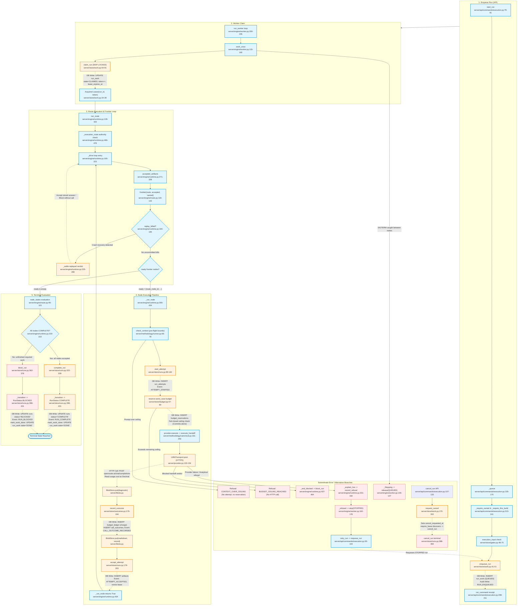

# Feature 4 Flowchart: Execution Engine & Worker Runtime

**Date:** 2026-09-15
**Feature:** Execution Engine & Worker Runtime
**Scope:** Background worker polling loop, pure frontier evaluation, lease fencing, pre-flight context checks, fail-closed budget reservation, OpenRouter HTTPS invocation, attempt outcome recording, and atomic run completion.

---

## 1. Sources Consulted

- `server/api/commands/execution.py:1-273` — API commands (`start_run`, `retry_run`, `cancel_run`), pin & fingerprint verification, command envelopes.
- `server/store/work.py:1-217` — Work queue state machine (`enqueue_run`, `claim_run`, `require_lease`, `release`, `stop`, `requeue_run`, `request_cancel`, `mark_work_done`).
- `server/engine/worker.py:1-304` — Background worker process (`run_worker`, `work_once`, `pause_seconds`, `_refused`, `_settle`, `price_from_environment`, SIGTERM handler).
- `server/engine/runtime.py:1-478` — Frontier execution loop (`run_route`, `_drive`, `accepted_artifacts`, `_run_node`, `_settle`, `_end_blocked`, `_explain_live`).
- `server/pricing.py:1-68` — Worst-case ceiling calculation (`worst_case`), `ModelPrice` dataclass.
- `server/store/budget.py:1-171` — Fail-closed budget reservation (`reserve`, `_reserve`, `_remaining`, `validate_spend`, `reserved_for`).
- `server/provider.py:1-465` — OpenRouter client, HTTPS urllib transport (`UrllibTransport`, `_opener`), request encoding, Decimal cost extraction (`_completion`, `_content`).
- `server/store/outcomes.py:1-360` — Attempt checking & outcomes (`require_idle`, `execution_reads`, `check_call`, `record_outcome`, `record_refusal`, `accepted_rows`, `_record`).
- `server/store/runs.py:1-451` — Run lifecycle & transitions (`start_attempt`, `accept_attempt`, `complete_run`, `block_run`, `cancel_run`, `_transition`, `_require_terminal_decision`).
- `server/methodology/runner.py:1-138` — `ModuleProvider` implementation bridging `runtime.Provider` to canonical execution.
- `server/methodology/canonical.py:160-260` — `execute_handoff` pipeline calling provider and recording initial outcome.

---

## 2. Primary Execution Flowchart

---

## 3. External Dependencies

1. **Governance & Request Handling (Feature 1)**:
   - `server/api/commands/_request.py`: `require_case_writer`, `command_response`, `json_body`, `Key`.
   - `server/store/commands.py`: `run_command`, `request_digest`.
   - `server/store/audit.py`: `GovernedAction`.
   - `server/store/members.py`: `Standing`.
2. **Route Graph & Manifest Authority (Feature 2 & 3)**:
   - `server/engine/route.py`: `ResolvedRoute`, `RouteNode`, `frontier`, `node_states`, `NodeState`, `NamedObjects`, `EdgeType`.
   - `server/methodology/bundle.py`: `Bundle`, `verify_manifest`.
   - `server/methodology/invocation.py`: `named_objects`.
3. **Gate Approval & Input Pinning (Feature 3)**:
   - `server/store/gates.py`: `execution_input`, `approved_run_input`, `require_adapter_route`.
   - `server/store/run_inputs.py`: `load_run_input`.
4. **Methodology Execution & Canonical Adapter (Feature 5)**:
   - `server/methodology/runner.py`: `ModuleProvider`.
   - `server/methodology/canonical.py`: `check_context`, `execute_handoff`, `replay_billed`, `blocked_verdict`, `accepted_projections`.
5. **Storage & Blob Infrastructure (Feature 7)**:
   - `server/blobs.py`: `BlobStore` (content-addressed storage for artifacts, records, and raw diagnostics).
   - `server/store/__init__.py`: `StoreConnection`, `RunStatus`, `connect`, `apply_schema`, `rollback_or_close`.
   - `server/store/events.py`: `lock_run`, `append`, `RunEvent`.
   - `server/store/cases.py`: `lock_case`.
   - `server/refusals.py`: `Refusal`, `RefusalCode`.
