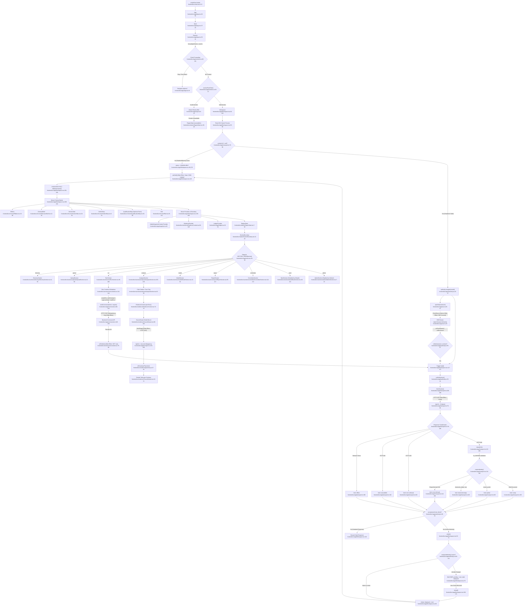

# Feature 8 Flowchart: Frontend Workspace UI

**Date:** 2026-09-15
**Feature:** Frontend Workspace UI
**Scope:** Browser single-page application, 4 invariant chrome bands (Ribbon, Decision Brief, Section Tabs, Verdict Strip), 9 workspace sections, SSE reactive stream tail, monotonic authority state machine, stale-while-revalidate (SWR) analytical identity reconciliation, Evidence/Source drawers with QuadPoint coordinate normalization, and idempotent command dispatch.

---

## 1. Sources Consulted

- `frontend/src/main.tsx:1-14`: React root initialization and CSS token mount.
- `frontend/src/app/App.tsx:1-57`: BrowserRouter shell, absent route handling, resolve dispatch.
- `frontend/src/app/sections.ts:1-102`: Section registry, enabled sections list, path forwarding, slug renames.
- `frontend/src/app/Workspace.tsx:1-253`: Main workspace layout, route parameter tracking, authority lifecycle, adopt/visible reconciliation, SSE tail integration.
- `frontend/src/app/transport.ts:1-301`: HTTP transport, wire validation, V1 document parsing, qualification fetch, page fetch.
- `frontend/src/app/commands.ts:1-239`: Governed mutation commands, idempotency key generation/reuse, receipt parsing.
- `frontend/src/app/sse.ts:1-48`: Server-Sent Events connection lifecycle, reconnection handlers, event dispatch.
- `frontend/src/app/authority.ts:1-166`: Monotonic seq authority machine, ticket acceptance, snapshot ledger bindings, refetch mapping, analytical identity hashing.
- `frontend/src/app/snapshot.ts:1-25`: Visible snapshot context and hook for pinning viewed version.
- `frontend/src/app/ledger.tsx:1-41`: Comparison ledger provider and snapshot binding interface.
- `frontend/src/app/views.tsx:1-39`: Section to View component mapping registry.
- `frontend/src/chrome/Ribbon.tsx:1-87`: Band 1: brand, case chip, status chips, state, actions.
- `frontend/src/chrome/DecisionBrief.tsx:1-27`: Band 2: CHANGE, IMPACT, ACTION, EVIDENCE, and headline.
- `frontend/src/chrome/SectionTabs.tsx:1-63`: Band 3: Section sub-views with roving tabindex keyboard navigation.
- `frontend/src/chrome/VerdictStrip.tsx:1-20`: Band 4: Conclusion severity, text, and blocking reason.
- `frontend/src/chrome/ServedRole.tsx:1-15`: Served role display and case standing label.
- `frontend/src/chrome/QualificationStrip.tsx:1-91`: Global performed-evidence verification strip and live fetch.
- `frontend/src/chrome/Rail.tsx:1-114`: Workspace navigation rail, section status/counts, served role, refused actions.
- `frontend/src/chrome/compose.ts:1-60`: Client-side synthesis of Chrome bands for V1 documents.
- `frontend/src/chrome/fallback.ts:1-88`: Fallback Chrome composition for loading/unavailable/offline/error states.
- `frontend/src/evidence/EvidenceContext.tsx:1-130`: Evidence coordinator, modal state, active citation/passport/fact tracking.
- `frontend/src/evidence/EvidenceDrawer.tsx:1-122`: Evidence modal for render URLs, silhouettes, bounding boxes, matched text.
- `frontend/src/evidence/SourceDrawer.tsx:1-193`: V1 source fact drawer, token-index text layer, live geometry overlays, withdrawal notice.
- `frontend/src/evidence/CitationChip.tsx:1-36`: Clickable evidence chip button binding to EvidenceContext.
- `frontend/src/evidence/MetricPassport.tsx:1-115`: 10-field passport modal, driver citations, deviation records.
- `frontend/src/evidence/geometry.ts:1-45`: Frame coordinate normalization to fraction box for y-up and y-down axes.
- `frontend/src/sections/directory/DirectorySection.tsx:1-56`: Case register table container and inline NewCase form.
- `frontend/src/sections/upload/UploadSection.tsx:1-61`: Source pack view container and set versions sidebar.
- `frontend/src/sections/analysis/AnalysisSection.tsx:1-220`: Accepted handoff cards, host facts, model analysis, pending node list.
- `frontend/src/sections/book/BookSection.tsx:1-132`: Portfolio cases table / comparison matrix, facet filtering, ledger binding.
- `frontend/src/sections/run/RunSection.tsx:1-269`: Route graph DAG, node detail, gate list, run switcher, work controls.
- `frontend/src/sections/run/controls.tsx:1-542`: Pin input, route choices, gate preview, gate approval, start/retry/cancel commands.
- `frontend/src/sections/model/ModelSection.tsx:1-95`: Accepted CP-CF projection period table, units, and limitation flags.
- `frontend/src/sections/report/ReportSection.tsx:1-118`: Saved report revisions, markdown/record artifacts, narrative paragraphs.
- `frontend/src/sections/committee/CommitteeSection.tsx:1-173`: Saved committee deliverables, signers, frozen/filed state, filing receipts.
- `frontend/src/sections/admin/AdminSection.tsx:1-24`: Admin unavailable capability surface.
- `frontend/src/states/RegionState.tsx:1-93`: Region status discriminator: loading, ready, observed-empty, error, unavailable, stale, offline, partial.
- `frontend/src/states/SectionBoundary.tsx:1-26`: React error boundary catching section render failures to render RENDER_FAILED refusal.

---

## 2. Primary Execution Flowchart

---

## 3. External Dependencies

### Query & Section Fetch Endpoints (`transport.ts`)
1. `GET /api/v1/directory` — Directory case register query.
2. `GET /api/v1/cases/:caseId/upload` — Admitted source pack and set versions.
3. `GET /api/v1/cases/:caseId/run?run=:runId` — Pinned route, DAG nodes, attempts, and gate status.
4. `GET /api/v1/cases/:caseId/analysis?run=:runId` — Accepted handoffs, citations, model prose, and pending route nodes.
5. `GET /api/v1/cases/:caseId/model?run=:runId` — CP-CF forecast projections and period valuation table.
6. `GET /api/v1/cases/:caseId/report?run=:runId&revision=:revisionId` — Saved narrative report and markdown/record artifacts.
7. `GET /api/v1/cases/:caseId/committee?run=:runId&revision=:revisionId` — Committee deliverable, signers, and filing receipts.
8. `GET /api/v1/cases/:caseId/events?run=:runId` — Real-time Server-Sent Events stream for case activity.
9. `GET /api/v1/cases/:caseId/runs/:runId/sources/:sourceId/pages/:page` — Token-index text layer and layout frames for source documents.
10. `GET /api/v1/qualification/:evidenceSha256` — Global evidence verification status and expiration time.

### Governed Command Endpoints (`commands.ts`)
1. `POST /api/v1/cases` — Create new case (`title`) with `Idempotency-Key`.
2. `POST /api/v1/cases/:caseId/sources` — Multipart form-data admission of files (`document` parts) with `Idempotency-Key`.
3. `POST /api/v1/cases/:caseId/runs` — Create and pin route for a new run (`profile_id`, `selection_id`) with `Idempotency-Key`.
4. `POST /api/v1/cases/:caseId/runs/:runId/input` — Pin subject input parameters (`issuer_id`, `issuer_name`, `reporting_period`, `analysis_date`) with `Idempotency-Key`.
5. `GET /api/v1/cases/:caseId/runs/:runId/gates/:gateSlug/preview` — Read exact gate preview markdown (no idempotency key).
6. `POST /api/v1/cases/:caseId/runs/:runId/gates/:gateSlug/approval` — Approve gate with `preview_sha256` and `input_fingerprint` with `Idempotency-Key`.
7. `POST /api/v1/cases/:caseId/runs/:runId/start` — Start pinned run with `input_fingerprint` and `Idempotency-Key`.
8. `POST /api/v1/cases/:caseId/runs/:runId/retry` — Retry failed run attempt with `input_fingerprint` and `Idempotency-Key`.
9. `POST /api/v1/cases/:caseId/runs/:runId/cancel` — Cancel active run with `Idempotency-Key`.
