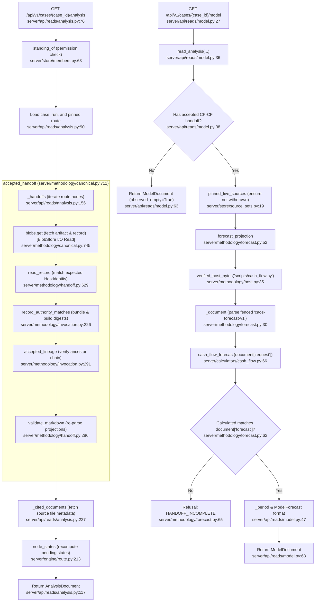

# Feature 5 Flowchart: Methodology Bundle, Canonical Validation & Financial Calculators

**Date:** 2026-09-15
**Feature:** Methodology Bundle, Canonical Validation & Financial Calculators
**Scope:** At-use Deploy V bundle byte verification, isolated in-memory vendor contracts, canonical markdown schema enforcement, QuadPoint coordinate citation anchoring, CP-CF deterministic Decimal cash flow calculation, and recomputed read projections.

---

## 1. Sources Consulted

- `server/methodology/bundle.py:1-380`: Immutable `Bundle`, read-only Deploy V manifest integrity checks at use, `verified_bytes`, `verified_root_bytes`, `delivered_authority`, `assemble_authority`, authority hashing (`authority_digest`, `delivered_authority_digest`).
- `server/methodology/canonical.py:1-956`: Canonical attempt execution (`execute_handoff`), post-call verdict derivation (`_answer`), pre-attempt ceiling probe (`check_context`), billed replay (`replay_billed`), accepted projection re-derivation (`accepted_handoff`, `accepted_projections`, `_verified_accepted`), owner bindings (`_forecast_inputs`), and lineage verification (`_upstream_records`).
- `server/methodology/forecast.py:1-173`: CP-CF deterministic forecast projection (`forecast_projection`), driver mapping checks (`validate_driver_mapping`), and JSON-pointer owner binding checks (`validate_forecast_bindings`).
- `server/methodology/handoff.py:1-661`: Conforming canonical Markdown validation (`validate_markdown`), invocation front-matter synthesis (`invocation_fields`), closed JSON wire transport parsing (`parse_response`), canonical record serialization (`record_bytes`), strict deserialization (`read_record`), and lineage traversal (`stored_lineage`).
- `server/methodology/invocation.py:1-998`: Host identity construction (`host_identity`, `prospective_identity`, `call_time_identity`), methodology authority matching (`record_authority_matches`), prompt synthesis (`build_handoff_prompt`), and request byte ceiling validation (`within_request_ceiling`).
- `server/methodology/runner.py:1-138`: Frontier loop integration via `ModuleProvider`, pre-call context checks (`ModuleProvider.check_context`), execution wrapper (`ModuleProvider.execute`), and blob persistence.
- `server/methodology/executor.py:1-115`: Shared execution identity (`Assignment`), evidence delivery structures (`Delivery`, `_delivered`, `captured_blocks`), and adapter pin verification (`_stored_identity`).
- `server/methodology/vendor.py:1-179`: Isolated in-memory loading of verified vendor validator scripts (`load_vendor_contract`, `VendorContract`) via private `_Loader` sandbox.
- `server/methodology/host.py:1-62`: Host extension integrity verification (`host_skill`, `verified_host_bytes`, `verify_extension`) against `HOST_MANIFEST_SHA256`.
- `server/methodology/host_pin.py:1-6`: Compiled SHA-256 digest pin of the host manifest.
- `server/calculators/cash_flow.py:1-408`: Pure, bounded, deterministic Decimal cash flow calculation (`cash_flow_forecast`, `forecast_bytes`, `_enforce_work_factor`, `_project_period`).
- `methodology/skills/HOST_INTEGRITY_v1.json:1-14` & `methodology/skills/cp-cf/SKILL.md:1-33`: CP-CF host skill definition and integrity hashes.
- `server/api/reads/analysis.py:1-303`: Analysis section reader (`read_analysis`, `_handoffs`), reading accepted canonical handoffs in route order and pending states.
- `server/api/reads/model.py:1-96`: Model section reader (`read_model`), recomputing and projecting accepted CP-CF financial forecast without UI arithmetic.

---

## 2. Primary Execution Flowchart (Module Execution Happy Path)

```mermaid
flowchart TD
    %% Entry Point
    START["ModuleProvider.execute<br/>server/methodology/runner.py:89"] --> CHK_CALL["check_call (verify attempt lease)<br/>server/store/outcomes.py:91"]
    CHK_CALL --> CHK_IN["_stored_identity (verify adapter pin)<br/>server/methodology/executor.py:100"]
    CHK_IN --> EXEC_HANDOFF["execute_handoff<br/>server/methodology/canonical.py:161"]

    %% Pre-Call Phase
    subgraph PreCall["Pre-Call Read Unit (server/methodology/canonical.py:178)"]
        EXEC_HANDOFF --> GET_ID["host_identity (read subject & route facts)<br/>server/methodology/invocation.py:74"]
        GET_ID --> GET_CTX["_context (deliveries, upstreams, lineage)<br/>server/methodology/canonical.py:410"]
        GET_CTX --> READ_DEL["_delivered (captured evidence blocks)<br/>server/methodology/executor.py:88"]
        GET_CTX --> UP_RECS["_upstream_records (verify accepted lineage)<br/>server/methodology/canonical.py:886"]
        UP_RECS --> AUTH_DEL["delivered_authority (verify manifest & SKILL bytes)<br/>server/methodology/bundle.py:311"]
        AUTH_DEL --> PROMPT["build_handoff_prompt (anti-injection tag & sections)<br/>server/methodology/invocation.py:842"]
        PROMPT --> CEIL["within_request_ceiling (request <= 26MB ceiling)<br/>server/methodology/invocation.py:990"]
        CEIL --> VERIFY_MAN["bundle.verify_manifest<br/>server/methodology/bundle.py:69"]
    end

    %% External LLM Invocation & Diagnostic Commitment
    VERIFY_MAN --> REQ_IDLE1["require_idle (DB connection)<br/>server/store/outcomes.py:95"]
    REQ_IDLE1 --> LLM_CALL["CompletionProvider.complete<br/>[HTTP Call / External LLM API]<br/>server/methodology/canonical.py:204"]
    LLM_CALL --> DIAG_PUT["blobs.put (store raw completion diagnostic)<br/>[BlobStore I/O Write]<br/>server/methodology/canonical.py:137"]
    DIAG_PUT --> REQ_IDLE2["require_idle (DB connection)<br/>server/store/outcomes.py:95"]
    REQ_IDLE2 --> REC_OUTCOME["record_outcome (bill attempt & commit spend)<br/>[PostgreSQL DB Write]<br/>server/store/outcomes.py:212"]

    %% Post-Call Verification Phase
    subgraph PostCall["Post-Call Read Unit (server/methodology/canonical.py:227)"]
        REC_OUTCOME --> CHK_ATT["check_attempt<br/>server/store/outcomes.py:90"]
        CHK_ATT --> ID_STABLE{"_identity == identity?<br/>server/methodology/canonical.py:275"}
        ID_STABLE -->|No: Refuse| REF_ID["Refusal: ROUTE_IDENTITY_INVALID<br/>server/methodology/canonical.py:276"]
        ID_STABLE -->|Yes| PARSE_WIRE["parse_response (check JSON transport & quote verbatim)<br/>server/methodology/handoff.py:472"]
        PARSE_WIRE --> ASSEMBLE["assemble_authority (load full module files)<br/>server/methodology/bundle.py:349"]
        ASSEMBLE --> VAL_MD["validate_markdown (front-matter & schema)<br/>server/methodology/handoff.py:286"]
        VAL_MD --> VEND_VAL["VendorContract.validate_text<br/>server/methodology/vendor.py:143"]
        VEND_VAL --> VEND_COMP["VendorContract.completeness_check<br/>server/methodology/vendor.py:143"]
        VEND_COMP --> ANCHOR["verify_citations (locate QuadPoint bboxes)<br/>[PostgreSQL Token Reads]<br/>server/evidence/citations.py:161"]
        ANCHOR --> MOD_CHECK{"module == 'CP-CF'?"}
        MOD_CHECK -->|Yes| CF_VERIFY["_forecast_inputs (verify bindings & drivers)<br/>server/methodology/canonical.py:806"]
        CF_VERIFY --> CF_MATH["cash_flow_forecast (deterministic Decimal math)<br/>server/calculators/cash_flow.py:66"]
        CF_MATH --> REC_BUILD["CanonicalRecord construction<br/>server/methodology/canonical.py:303"]
        MOD_CHECK -->|No| REC_BUILD
        REC_BUILD --> REC_BYTES["record_bytes (canonical JSON serialization)<br/>server/methodology/handoff.py:494"]
    end

    %% Storage of Final Artifacts
    REC_BYTES --> BLOB_MD["blobs.put (store accepted Markdown)<br/>[BlobStore I/O Write]<br/>server/methodology/runner.py:123"]
    BLOB_MD --> BLOB_REC["blobs.put (store CanonicalRecord)<br/>[BlobStore I/O Write]<br/>server/methodology/runner.py:124"]
    BLOB_REC --> RET_RES["return ProviderResult<br/>server/methodology/runner.py:130"]
```

---

## 3. Read API & CP-CF Projection Verification Flowchart

---

## 4. External Dependencies

1. **Feature 1 (Edge Authentication & API Gateway)**:
   - Injects `Store`, `Blobs`, `Methodology` (Bundle), and `Caller` dependencies via `server/api/deps.py:117-121` into `read_analysis` and `read_model`.
2. **Feature 2 (Evidence Ingestion & Citation Anchoring)**:
   - Calls `server/evidence/citations.py:verify_citations` to locate token coordinates and compute QuadPoint bboxes.
   - Calls `server/evidence/citations.py:citation_candidates` during pre-call prompt building.
   - Calls `server/evidence/read.py:read_run_block` in `_delivered` (`server/methodology/executor.py:88`).
3. **Feature 3 (Case & Run Management & Route Resolution)**:
   - Consumes `ResolvedRoute` and `RouteNode` structures (`server/engine/route.py`).
   - Uses `server/store/routes.py:resolved_route` to verify pinned execution routes.
   - Reads case run inputs via `server/store/run_inputs.py:load_run_input`.
4. **Feature 4 (Execution Engine & Worker Runtime)**:
   - Called by `server/engine/worker.py` and `server/engine/runtime.py` via `ModuleProvider.execute(...)`.
   - Dispatches LLM calls via `server/provider.py:CompletionProvider`.
   - Records attempt costs and generation IDs into `server/store/outcomes.py:record_outcome`.
5. **Feature 7 (Storage, Content-Addressed Blobs & Transactional Governance Core)**:
   - Stores and retrieves raw markdown and records via `server/blobs.py:BlobStore.put` / `get`.
   - Sanitizes text representations using `server/boundary_text.py:BoundaryText`.
   - Uses transactional execution locks and reads (`execution_reads`, `check_call`, `check_attempt`).
