# Feature 7 Flowchart: Storage, Content-Addressed Blobs & Transactional Governance Core

**Date:** 2026-09-15
**Feature:** Storage, Content-Addressed Blobs & Transactional Governance Core
**Scope:** PostgreSQL connection lifecycle, schema migrations, SHA-256 content-addressed blob storage (`BlobStore`), Unicode `BoundaryText` validation, idempotent command execution (`run_command`), atomic state + audit event pairing (`governed_write`), tamper-evident hash chaining, and monotonic run events.

---

## 1. Sources Consulted

- `server/store/__init__.py:1-274`: PostgreSQL connection management (`connect`), schema migrations definition (`MIGRATIONS` 0001-0020), transactional advisory lock (`_SCHEMA_LOCK`), migration executor (`_migrate`), startup migration gate (`apply_schema`), and runtime health verifier (`verify_schema`).
- `server/store/schema.sql:1-267`: Base relational DDL declaring core business and governance tables (`cases`, `runs`, `run_attempts`, `artifacts`, `run_events`, `budget_ledger`, `sources`, `live_sources`, `source_blocks`, `source_tokens`, `run_routes`, `budget_reservations`, `case_members`, `audit_events`, `audit_chain_heads`, `run_gates`, `deliverable_opinions`, `deliverable_publications`).
- `server/blobs.py:1-112`: Filesystem content-addressed blob store (`BlobStore`), directory sharding (`_SHARD=2`), hex address validation (`path_of`), durable atomic staging and directory sync (`put`, `_stage`, `_sync_directory`), and re-hashing verification reader (`get`).
- `server/boundary_text.py:1-50`: Inbound text sanitization value object (`BoundaryText.of`), Unicode NFC normalization, Trojan Source / BIDI control code refusal (`_BIDI`), and control character validation.
- `server/store/audit.py:1-242`: Transactionally paired governed writes (`governed_write`), live commit-time standing enforcement (`_require_standing`), audit trail queries (`audit_trail`, `actions_after`, `audit_head`), tamper-evident cryptographic hash chain construction (`_link`, `_hash`), and chain verification (`verify_chain`).
- `server/store/commands.py:1-269`: Governed idempotent command execution engine (`run_command`), canonical request digest generation (`request_digest`), committed receipt cache lookups (`find_receipt`), atomic receipt storage (`record_receipt`), and concurrent twin resolution.
- `server/store/events.py:1-100`: Per-run monotonic event stream (`RunEvent`, `append`), row-level hierarchical locking (`lock_run`), and event history retrieval (`events_of`).
- `server/store/members.py:1-145`: Case standing authority model (`Standing`, `_RANK`), grant/revoke mutations under case locks (`grant`, `revoke`), live authority checks (`standing_of`, `satisfies`), and member case catalog queries (`cases_for_member`).
- `server/store/cases.py:1-31`: Case row-level locking gateway (`lock_case`) with strict `READ COMMITTED` and transactional session validation.
- `server/store/runs.py:46-54`: Baseline case insertion helper (`create_case`).
- `server/api/commands/cases.py:92-139`: Case creation command entry point (`create_case_command`), nil-scoped idempotency, and creator admin bootstrap (`_open_case`).
- `server/store/extraction_integrity.py:1-99`: Migration 0008 historical extraction verifier (`_verify_extractions_v1`), token coordinate reconstruction, block ordering validation, and migration-time proof validation.

---

## 2. Primary Execution Flowchart

```mermaid
flowchart TD
    classDef happy fill:#e1f5fe,stroke:#0288d1,stroke-width:2px;
    classDef sideeffect fill:#fff3e0,stroke:#f57c00,stroke-width:2px;
    classDef fallback fill:#ffebee,stroke:#d32f2f,stroke-dasharray: 5 5;

    %% Entry point 1: Application Boot & Migration
    subgraph Boot ["System Startup & Schema Migration Gate"]
        START_BOOT["FastAPI Lifespan / Worker Startup<br/>server/api/app.py:180"]:::happy --> CONNECT_BOOT["connect(url)<br/>server/store/__init__.py:151"]:::happy
        CONNECT_BOOT --> APPLY_SCHEMA["apply_schema(conn)<br/>server/store/__init__.py:170"]:::happy
        APPLY_SCHEMA --> MIGRATE["_migrate(conn, sql)<br/>server/store/__init__.py:221"]:::happy
        MIGRATE --> ADV_LOCK["pg_advisory_xact_lock(_SCHEMA_LOCK)<br/>server/store/__init__.py:226<br/>[DB Advisory Lock]"]:::sideeffect
        ADV_LOCK --> CHK_HISTORY{"Check applied prefix vs expected<br/>server/store/__init__.py:238"}:::happy
        CHK_HISTORY -- Drift Detected --> DRIFT_REFUSAL["Raise Refusal(STORE_SCHEMA_DRIFT)<br/>server/store/__init__.py:243"]:::fallback
        CHK_HISTORY -- Version 0008 Pending --> V1_VERIFY["_verify_extractions_v1(conn)<br/>server/store/extraction_integrity.py:19<br/>[DB Table Lock & Cursor Proof]"]:::sideeffect
        V1_VERIFY --> APPLY_DDL["Execute Migration SQL & INSERT store_migrations<br/>server/store/__init__.py:262<br/>[DB DDL & Write]"]:::sideeffect
        CHK_HISTORY -- Apply Migrations --> APPLY_DDL
        APPLY_DDL --> UPDATE_DIGEST["Upsert store_schema.applied_digest<br/>server/store/__init__.py:268<br/>[DB Write]"]:::sideeffect
        UPDATE_DIGEST --> COMMIT_BOOT["conn.commit()<br/>server/store/__init__.py:180<br/>[DB Commit]"]:::sideeffect
    end

    %% Entry point 2: Input Boundary & Content-Addressed Blob Storage
    subgraph Storage ["Content-Addressed Blob Storage (CAS)"]
        BLOB_IN["Raw Binary Document / Artifact Bytes<br/>server/blobs.py:47"]:::happy --> BLOB_PUT["BlobStore.put(data)<br/>server/blobs.py:47"]:::happy
        BLOB_PUT --> BLOB_HASH["Compute sha256(data)<br/>server/blobs.py:57<br/>[SHA256 Hash]"]:::sideeffect
        BLOB_HASH --> BLOB_PATH["path_of(digest)<br/>server/blobs.py:41"]:::happy
        BLOB_PATH -- Regex Mismatch --> BLOB_INV["Raise Refusal(BLOB_ADDRESS_INVALID)<br/>server/blobs.py:44"]:::fallback
        BLOB_PATH -- Valid Hex Address --> BLOB_STAGE["_stage(data, dir)<br/>server/blobs.py:68<br/>[I/O Temp File & fsync]"]:::sideeffect
        BLOB_STAGE --> BLOB_REPLACE["os.replace(staged, destination)<br/>server/blobs.py:63<br/>[I/O Atomic Rename]"]:::sideeffect
        BLOB_REPLACE --> BLOB_SYNC["_sync_directory(parent)<br/>server/blobs.py:83<br/>[I/O Directory fsync]"]:::sideeffect
        BLOB_SYNC --> BLOB_RET["Return digest<br/>server/blobs.py:65"]:::happy

        BLOB_GET_REQ["BlobStore.get(digest)<br/>server/blobs.py:97"]:::happy --> BLOB_READ["path.read_bytes()<br/>server/blobs.py:106<br/>[I/O Read]"]:::sideeffect
        BLOB_READ -- File Not Found --> BLOB_NF["Raise Refusal(BLOB_NOT_FOUND)<br/>server/blobs.py:108"]:::fallback
        BLOB_READ --> BLOB_CHECK{"sha256(data) == digest?<br/>server/blobs.py:109<br/>[SHA256 Check]"}:::happy
        BLOB_CHECK -- Mismatch --> BLOB_MISMATCH["Raise Refusal(BLOB_DIGEST_MISMATCH)<br/>server/blobs.py:110"]:::fallback
        BLOB_CHECK -- Verified Match --> BLOB_DATA["Return verified bytes<br/>server/blobs.py:111"]:::happy
    end

    %% Entry point 3: Governed Idempotent Command Execution
    subgraph Governance ["Idempotent Command Execution & Governance Core"]
        CMD_REQ["Client HTTP POST Command Request<br/>server/api/commands/cases.py:92"]:::happy --> BND_TEXT["BoundaryText.of(raw_text)<br/>server/boundary_text.py:43"]:::happy
        BND_TEXT -- Control/BIDI Characters --> BND_REFUSE["Raise Refusal(BOUNDARY_TEXT_INVALID)<br/>server/boundary_text.py:46"]:::fallback
        BND_TEXT -- Length > Limit --> BND_LONG["Raise Refusal(BOUNDARY_TEXT_TOO_LONG)<br/>server/boundary_text.py:48"]:::fallback
        BND_TEXT -- Valid NFC Text --> RUN_CMD["run_command(conn, scope, key, ...)<br/>server/store/commands.py:141"]:::happy

        RUN_CMD --> DIGEST_REQ["request_digest(command, ...)<br/>server/store/commands.py:71<br/>[Canonical JSON SHA256]"]:::sideeffect
        DIGEST_REQ --> PRE_LOOKUP["_lookup(conn, row)<br/>server/store/commands.py:238<br/>[DB Select command_requests]"]:::happy
        PRE_LOOKUP -- Receipt Exists & Hash Matches --> REPLAY_CMD["_replay: Return CommandResult(replayed=True)<br/>server/store/commands.py:260"]:::happy
        PRE_LOOKUP -- Receipt Exists & Hash Differs --> KEY_REUSED["Raise Refusal(IDEMPOTENCY_KEY_REUSED)<br/>server/store/commands.py:267"]:::fallback

        PRE_LOOKUP -- Fresh Key --> PREPARE_CHK{"prepare callable provided?<br/>server/store/commands.py:175"}:::happy
        PREPARE_CHK -- Yes (e.g. _open_case) --> RUN_PREPARE["_prepare: INSERT cases & grant creator ADMIN<br/>server/api/commands/cases.py:132<br/>[DB Write]"]:::sideeffect
        PREPARE_CHK -- No / Prepared --> GOV_WRITE["governed_write(conn, action, _unit)<br/>server/store/audit.py:69"]:::happy

        GOV_WRITE --> LOCK_CASE["lock_case(conn, case_id)<br/>server/store/cases.py:9<br/>[DB Lock SELECT FOR UPDATE]"]:::sideeffect
        LOCK_CASE --> LOCK_HEAD["_lock_head(conn, case_id)<br/>server/store/audit.py:203<br/>[DB Lock SELECT FOR UPDATE]"]:::sideeffect
        LOCK_HEAD --> CHK_STANDING["_require_standing -> standing_of & satisfies<br/>server/store/audit.py:125<br/>[DB Select case_members]"]:::happy
        CHK_STANDING -- Insufficient / Revoked --> AUTH_FAIL["Raise Refusal(NOT_AUTHORISED) -> CASE_NOT_FOUND<br/>server/store/commands.py:186"]:::fallback

        CHK_STANDING -- Authorized --> UNIT_CALL["_unit(inner)<br/>server/store/commands.py:214"]:::happy
        UNIT_CALL --> TWIN_CHECK["find_receipt(inner)<br/>server/store/commands.py:215<br/>[DB Select command_requests]"]:::happy
        TWIN_CHECK -- Concurrent Twin Won --> TWIN_EXC["Raise _Twin -> _replay or STORE_UNAVAILABLE<br/>server/store/commands.py:217"]:::fallback
        TWIN_CHECK -- Slot Open --> DOMAIN_WRITE["write(inner): Domain Mutation Callback<br/>server/store/commands.py:218<br/>[DB Write State Changes]"]:::sideeffect

        %% Run events emitted during domain write
        DOMAIN_WRITE -. If Run State Transition .-> EMIT_EVENT["append(conn, run_id, event)<br/>server/store/events.py:72"]:::happy
        EMIT_EVENT --> LOCK_RUN["lock_run(conn, run_id)<br/>server/store/events.py:52<br/>[DB Lock runs FOR UPDATE]"]:::sideeffect
        LOCK_RUN --> INSERT_EVENT["INSERT INTO run_events (seq = max(seq)+1)<br/>server/store/events.py:84<br/>[DB Write Monotonic Event]"]:::sideeffect
        INSERT_EVENT -. Return to unit .-> REC_RECEIPT

        DOMAIN_WRITE --> REC_RECEIPT["record_receipt(inner, ...)<br/>server/store/commands.py:115<br/>[DB Write command_requests]"]:::sideeffect
        REC_RECEIPT -- Conflict on Insert --> TWIN_REC["Raise _Twin<br/>server/store/commands.py:232"]:::fallback

        REC_RECEIPT --> AUDIT_DIGEST["_digest_of(action.payload)<br/>server/store/audit.py:214<br/>[SHA256 Payload Hash]"]:::sideeffect
        AUDIT_DIGEST --> AUDIT_LINK["_link(action, seq, previous, payload_sha256)<br/>server/store/audit.py:221<br/>[SHA256 Hash Chain Link]"]:::sideeffect
        AUDIT_LINK --> AUDIT_EVENT_INSERT["INSERT INTO audit_events<br/>server/store/audit.py:89<br/>[DB Write Audit Link]"]:::sideeffect
        AUDIT_EVENT_INSERT --> HEAD_UPSERT["Upsert audit_chain_heads<br/>server/store/audit.py:102<br/>[DB Write Head Pointer]"]:::sideeffect
        HEAD_UPSERT --> AFTER_EVENT{"after_event callable?<br/>server/store/audit.py:108"}:::happy
        AFTER_EVENT -- Yes --> AFTER_CALL["after_event(conn, entry_sha256)<br/>server/store/audit.py:109<br/>[DB Write Linked Receipt]"]:::sideeffect
        AFTER_EVENT -- No / Done --> TX_COMMIT["conn.commit()<br/>server/store/audit.py:110<br/>[DB Atomic Commit]"]:::sideeffect
        TX_COMMIT --> CMD_RES["Return CommandResult(status, body, replayed=False)<br/>server/store/commands.py:189"]:::happy
    end
```

---

## 3. External Dependencies

1. **PostgreSQL 17 (`psycopg` driver)**:
   - Explicit transactions (`autocommit=False`), transactional session isolation level checking (`read committed`).
   - Transactional advisory locking (`pg_advisory_xact_lock` for schema migrations).
   - Strict row-level pessimistic locking (`SELECT ... FOR UPDATE` on `cases`, `runs`, and `audit_chain_heads`).
   - Table-level concurrency locking (`LOCK TABLE ... IN SHARE ROW EXCLUSIVE MODE` during migration verification).
   - Binary data transmission (`binary=True`) for float coordinate extraction integrity checks.
2. **Operating System Filesystem & POSIX Semantics**:
   - Atomic replacement (`os.replace`) across POSIX filesystems.
   - Durability flushing (`os.fsync`) of file descriptors and directory descriptors (`os.open(dir, os.O_RDONLY)`).
   - Temporary file creation (`tempfile.NamedTemporaryFile`).
3. **Unicode Standard**:
   - `unicodedata.normalize("NFC", ...)` normalization and category mapping (`Cc`, `Cs`).
   - Character code point range checking for Trojan Source / BIDI control exclusions.
4. **Standard Library Cryptography**:
   - `hashlib.sha256` for content-addressed blob keys, canonical JSON request digests, audit hash links, and migration history hashing.
5. **Cross-Feature Imports within Codebase**:
   - `server/refusals.py`: Provides `Refusal` and `RefusalCode` used everywhere.
   - `server/evidence/extract.py` and `server/evidence/ingest.py`: `ExtractorIdentity` and canonical `_digest` imported by `server/store/extraction_integrity.py` during migration 0008 execution.
