# CAOS v2 — Proposed Unified Architecture

**Date:** 2026-09-15
**Author:** Pathfinder Orchestrator
**Phase:** Phase 3 Unified Proposal
**Target:** Elimination of accidental duplication, performance bottlenecks, and divergent hash/proof implementations across CAOS v2.

---

## 1. Design Philosophy: The Simplest Unified System

Pathfinder proposals follow five non-negotiable principles:
1. **Prefer deletion over abstraction:** Eliminate redundant layers rather than wrapping them in interfaces.
2. **One path for one concern:** One outcome recorder, one canonical JSON serializer, one artifact proof engine, and one read-visibility dependency.
3. **No feature flags for dead paths:** Remove old divergent branches completely upon migration.
4. **Reject flexible registries when static imports suffice:** Direct function calls over indirection layers.
5. **Preserve domain specializations:** Distinct trust boundaries (HTTP multipart streaming vs local disk loading, macro run states vs micro node states) are preserved where legitimate.

---

## 2. Unification Proposals for Accidental Duplications

### Unification 1: Single-Point Outcome Recording (Elimination of 3x Redundancy)

#### Problem
Every executed node attempt triggers `record_outcome` three consecutive times across `server/methodology/canonical.py:212`, `server/engine/runtime.py:410`, and `server/store/runs.py:215`. Each invocation begins a new database transaction, acquires a row lock on `run_attempts`, queries `call_outcomes`, and commits.

#### Unified Design
The external provider invocation layer owns recording the outcome immediately upon transport completion to guarantee spend accounting even if response validation fails (Invariant 8). Downstream layers must assume the outcome has been recorded.

#### Consolidated Component
- **Component:** `server/store/outcomes.py`
- **Single Entry Point:** `record_outcome(conn: StoreConnection, attempt_id: UUID, outcome: CallOutcome) -> bool`

#### Call Site Transformations
- **`server/methodology/canonical.py:212-216`** $\rightarrow$ **RETAINED** as the single authoritative call site:
  ```python
  record_outcome(conn, attempt_id=attempt, outcome=CallOutcome(charge, model, generation, diagnostic))
  ```
- **`server/engine/runtime.py:410-419`** $\rightarrow$ **DELETED**. The runtime orchestrator relies on `execute_handoff` having recorded the outcome.
- **`server/store/runs.py:215-224`** $\rightarrow$ **REPLACED** with a lightweight sanity check:
  ```python
  # server/store/runs.py:215
  with conn.cursor() as cur:
      cur.execute("SELECT 1 FROM call_outcomes WHERE attempt_id = %s", (attempt,))
      if cur.fetchone() is None:
          raise Refusal(RefusalCode.STORE_CORRUPT)
  ```

#### Capability Loss
**None.** Eliminates 2 redundant transactions and 2 redundant row locks per node attempt, reducing database lock contention and attempt latency.

---

### Unification 2: Centralized Canonical JSON Serialization & Hashing

#### Problem
Ten different modules independently format dictionaries using `json.dumps(..., sort_keys=True, separators=(",", ":"))`. Because some omit `ensure_ascii=False`, non-ASCII characters are escaped as `\uXXXX` in audit logs and route stores, but preserved as raw UTF-8 in deliverable signatures and request digests, creating latent hash mismatch bugs.

#### Unified Design
Introduce a single, authoritative canonical JSON utility module implementing strict, reproducible RFC 8785-compliant JSON serialization.

#### Consolidated Component
- **Component:** `server/canonical_json.py`
- **Entry Points:**
  - `canonical_dumps(obj: object) -> str`
  - `canonical_bytes(obj: object) -> bytes`
  - `canonical_digest(obj: object) -> str` (computes SHA-256 over `canonical_bytes`)

```python
# server/canonical_json.py:1-24
import hashlib
import json

def canonical_dumps(obj: object) -> str:
    return json.dumps(obj, sort_keys=True, separators=(",", ":"), ensure_ascii=False, allow_nan=False)

def canonical_bytes(obj: object) -> bytes:
    return canonical_dumps(obj).encode("utf-8")

def canonical_digest(obj: object) -> str:
    return hashlib.sha256(canonical_bytes(obj)).hexdigest()
```

#### Call Site Transformations
- `server/deliverable/canonical.py:61` (`payload_bytes`) $\rightarrow$ `canonical_bytes(payload)`
- `server/deliverable/filing.py:189` (`receipt_bytes`) $\rightarrow$ `canonical_bytes(receipt)`
- `server/store/commands.py:85` (`request_digest`) $\rightarrow$ `canonical_digest(request)`
- `server/store/audit.py:214` (`_digest_of`) $\rightarrow$ `canonical_digest(payload)`
- `server/store/routes.py:207` (`_canonical`) $\rightarrow$ `canonical_bytes(route)`
- `server/engine/route.py:401` (`route_digest`) $\rightarrow$ `canonical_digest(route)`
- `server/qualification/store.py:28` (`Evidence.sha256`) $\rightarrow$ `canonical_digest(evidence)`
- `server/qualification/matrix.py:185` (`qualification_set_digest`) $\rightarrow$ `canonical_digest(canonical)`
- `server/calculators/cash_flow.py:118` (`cash_flow_digest`) $\rightarrow$ `canonical_digest(payload)`
- `server/evidence/ingest.py:290` (`_fingerprint`) $\rightarrow$ `canonical_digest(meta)`

#### Capability Loss
**None.** Eliminates ~80 lines of duplicate code and guarantees identical SHA-256 digests across all subsystems for Unicode text.

---

### Unification 3: Shared Canonical Artifact Verification Engine

#### Problem
Three distinct modules (`qualification/proof.py:207`, `deliverable/canonical.py:140`, `methodology/canonical.py:760`) implement the same 6-step verification pipeline for stored artifacts. They have drifted: `deliverable` does not cache token coordinates (causing an 8x N+1 SQL penalty), `qualification` and `methodology` hardcode `"CP-CF"` while `deliverable` uses `MODEL_MODULE`, and `methodology` skips citation verification.

#### Unified Design
Consolidate the artifact verification pipeline into a single pure function in `server/methodology/verification.py`.

#### Consolidated Component
- **Component:** `server/methodology/verification.py`
- **Single Entry Point:**
  ```python
  def verify_canonical_artifact(
      conn: StoreConnection,
      blobs: BlobStore,
      bundle: Bundle,
      *,
      run_id: UUID,
      node: RouteNode,
      delivered_blocks: Mapping[UUID, Sequence[str]],
      token_index: TokenIndex | None = None,
      reanchor_citations: bool = True,
      verify_manifest: bool = True,
  ) -> VerifiedArtifact:
  ```

#### Call Site Transformations
- **`server/qualification/proof.py:207-332`**: Replace `_CanonicalReader.proven` with:
  ```python
  verified = verify_canonical_artifact(
      self.conn, self.blobs, self.bundle,
      run_id=self.run_id, node=node,
      delivered_blocks=self.delivered,
      token_index=self.index,
      reanchor_citations=True,
      verify_manifest=True
  )
  ```
- **`server/deliverable/canonical.py:140-218`**: Replace `_Reader.proven` with:
  ```python
  # Initialise self.index = TokenIndex() on _Reader to eliminate N+1 SQL!
  verified = verify_canonical_artifact(
      self.conn, self.blobs, self.bundle,
      run_id=self.run_id, node=node,
      delivered_blocks=self.delivered,
      token_index=self.index,
      reanchor_citations=True,
      verify_manifest=True
  )
  ```
- **`server/methodology/canonical.py:760-884`**: Replace `_verified_accepted` with:
  ```python
  verified = verify_canonical_artifact(
      conn, blobs, bundle,
      run_id=run_id, node=node,
      delivered_blocks=delivered,
      token_index=None,
      reanchor_citations=False,
      verify_manifest=False
  )
  ```

#### Capability Loss
**None.** Eliminates ~250 lines of duplicate code, gives deliverable generation the 8x citation anchoring speedup via `TokenIndex`, and guarantees identical verification semantics across execution, reporting, and benchmarking.

---

### Unification 4: Unified Case Visibility Dependency for API Read Routes

#### Problem
Four different read routers implement ad-hoc authorization and case-fetching queries (`upload.py:65`, `run.py:188`, `analysis.py:87`, `reports.py:84`). Crucially, `reports.py:88` takes an exclusive database write lock (`lock_case(conn, case_id)`) on a GET read endpoint!

#### Unified Design
Define a single, cached FastAPI dependency `require_visible_case` in `server/api/deps.py` that validates the caller's standing (`Standing.READER`), queries case metadata with `IO_BUDGET = 1`, and raises `Refusal(RefusalCode.CASE_NOT_FOUND)` for unauthorized callers to prevent enumeration.

#### Consolidated Component
- **Component:** `server/api/deps.py`
- **Single Entry Point:**
  ```python
  VisibleCase = Annotated[CaseMetadata, Depends(require_visible_case)]
  ```

#### Call Site Transformations
- **`server/api/reads/upload.py:35`**:
  `async def read_upload(case: VisibleCase, store: Store, blobs: Blobs) -> UploadDocument:`
- **`server/api/reads/run.py:73`**:
  `async def read_run(case: VisibleCase, store: Store, ...) -> RunSectionDocument:`
- **`server/api/reads/analysis.py:46`**:
  `async def read_analysis(case: VisibleCase, store: Store, ...) -> AnalysisDocument:`
- **`server/api/reads/reports.py:41`**:
  `async def read_report(case: VisibleCase, store: Store, ...) -> ReportDocument:`
  *(Deletes `lock_case(conn, case_id)` write lock completely!)*

#### Capability Loss
**None.** Eliminates database lock contention on reports and ensures identical case visibility and standing checks across all 9 sections.

---

### Unification 5: Standardized API UUID Path Dependencies

#### Problem
Read endpoints duplicate manual `try...except ValueError` conversions to bypass FastAPI's default 422 error handler, which would otherwise leak internal schema details.

#### Unified Design
Introduce standard typed path and query parameter dependencies in `server/api/deps.py`.

#### Consolidated Component
- **Component:** `server/api/deps.py`
- **Entry Points:**
  - `CaseId = Annotated[UUID, Depends(path_case_id)]`
  - `RunId = Annotated[UUID, Depends(path_run_id)]`
  - `OptionalRunId = Annotated[UUID | None, Depends(query_run_id)]`

```python
def path_case_id(case_id: str) -> UUID:
    try:
        return UUID(case_id)
    except (ValueError, TypeError):
        raise Refusal(RefusalCode.CASE_NOT_FOUND) from None
```

#### Call Site Transformations
Replace manual string parsing in `server/api/reads/upload.py:45`, `run.py:176`, `analysis.py:53`, and `reports.py:50` with `CaseId` and `OptionalRunId`.

#### Capability Loss
**None.** Removes ~60 lines of repetitive boilerplate across routers.

---

### Unification 6: Shared Pinned Source SQL Query Fragment

#### Problem
An 18-line, 6-table SQL join verifying source-set membership and extraction integrity is duplicated verbatim between `server/evidence/read.py:37` (`_RUN_BLOCK_QUERY`) and `server/evidence/page.py:52` (`_PAGE_QUERY`).

#### Unified Design
Declare a single SQL query fragment constant `PINNED_SOURCE_JOIN_SQL` in `server/store/source_sets.py` imported by both readers.

#### Consolidated Component
- **Component:** `server/store/source_sets.py:PINNED_SOURCE_JOIN_SQL`

#### Call Site Transformations
- `server/evidence/read.py:37`: Uses `PINNED_SOURCE_JOIN_SQL` in `_RUN_BLOCK_QUERY`.
- `server/evidence/page.py:52`: Uses `PINNED_SOURCE_JOIN_SQL` in `_PAGE_QUERY`.

#### Capability Loss
**None.** Guarantees that block readers and page readers always apply identical extraction integrity filters.

---

### Unification 7: Frontend Governed Action Hook

#### Problem
`frontend/src/sections/directory/NewCase.tsx:64-108` and `frontend/src/sections/upload/AdmitSources.tsx:71-109` duplicate a 45-line state machine managing `Idempotency-Key` reuse on offline failure, pending spinners, error formatting, and document refetches.

#### Unified Design
Extract a custom React hook `useGovernedAction` in `frontend/src/app/useGovernedAction.ts`.

#### Consolidated Component
- **Component:** `frontend/src/app/useGovernedAction.ts`
- **Signature:**
  ```ts
  export function useGovernedAction<TArgs, TReceipt>(
    action: (intent: Intent, args: TArgs) => Promise<CommandResult<TReceipt>>,
    onSuccess: () => Promise<void> | void
  ): {
    submit: (args: TArgs) => Promise<void>;
    pending: boolean;
    error: string | null;
    refused: RefusalCode | null;
    reset: () => void;
  };
  ```

#### Call Site Transformations
- `frontend/src/sections/directory/NewCase.tsx`: Replaces 45 lines of state machine code with `const { submit, pending, error } = useGovernedAction(createCase, refetchDirectory);`.
- `frontend/src/sections/upload/AdmitSources.tsx`: Replaces 45 lines of state machine code with `const { submit, pending, error } = useGovernedAction(admitSources, refetchUpload);`.

#### Capability Loss
**None.** Eliminates ~90 lines of duplicate UI state logic.

---

## 3. Proposed Unified Architecture Mermaid Flowchart

The following comprehensive diagram illustrates the unified execution, storage, and governance architecture with all redundancies consolidated. Every node is labeled with its target `file:line`.

```mermaid
flowchart TD
    classDef unified fill:#e0f2fe,stroke:#0284c7,stroke-width:2px;
    classDef singlePath fill:#f0fdf4,stroke:#16a34a,stroke-width:2px;
    classDef storage fill:#fef3c7,stroke:#d97706,stroke-width:2px;
    classDef removed fill:#fee2e2,stroke:#dc2626,stroke-width:1px,stroke-dasharray: 5 5;

    %% Ingress & Gateway
    subgraph Gateway ["Edge & API Gateway (Unified Dependencies)"]
        REQ["Client HTTP / SSE Request<br/>server/api/site.py:122"] --> GUARD["EdgeGuard (Perimeter Check)<br/>server/api/edge.py:156"]
        GUARD --> ROUTER["FastAPI App Router<br/>server/api/app.py:192"]
        ROUTER --> DEP_CASE["require_visible_case (Unified Auth)<br/>server/api/deps.py:45"]:::unified
        ROUTER --> DEP_PARAM["CaseId & RunId Path Resolvers<br/>server/api/deps.py:75"]:::unified
    end

    %% Canonical JSON Hashing Unification
    subgraph HashCore ["Canonical JSON & Hashing Core (Single Provider)"]
        CANON_JSON["canonical_bytes & canonical_digest<br/>server/canonical_json.py:1-24"]:::unified
    end

    %% Governed Ingestion
    subgraph Ingestion ["Evidence Ingestion & Citation Anchoring"]
        ROUTER -->|"POST /sources"| ADMIT_CMD["admit_sources_command<br/>server/api/commands/cases.py:206"]
        ADMIT_CMD --> PREP_PACK["prepare_pack (In-Memory Sandbox)<br/>server/evidence/ingest.py:116"]
        PREP_PACK --> ADMIT_PREP["admit_prepared (Governed Unit)<br/>server/evidence/ingest.py:164"]
        ADMIT_PREP --> BLOB_STORE["BlobStore.put (CAS Storage)<br/>server/blobs.py:47"]:::storage
        ADMIT_PREP --> DB_SOURCES["INSERT sources, tokens, blocks<br/>server/evidence/ingest.py:310"]:::storage

        READ_BLK["read_evidence (Block Fetch)<br/>server/evidence/read.py:118"] --> JOIN_SQL["PINNED_SOURCE_JOIN_SQL<br/>server/store/source_sets.py:30"]:::unified
        READ_PAGE["read_page (Frame Fetch)<br/>server/evidence/page.py:95"] --> JOIN_SQL
        JOIN_SQL --> DB_SOURCES
    end

    %% Route Planning & Gates
    subgraph Management ["Case & Run Management"]
        ROUTER -->|"POST /runs"| RUN_CMD["create_run_command<br/>server/api/commands/runs.py:128"]
        RUN_CMD --> RESOLVE["resolve_route (Pure Topological DAG)<br/>server/engine/route.py:168"]
        RESOLVE --> PIN_ROUTE["pin_route_in (run_routes)<br/>server/store/routes.py:53"]:::storage
        ROUTER -->|"POST /gates/{g}/approval"| GATE_CMD["approve (Release Gate)<br/>server/api/commands/runs.py:263"]
        GATE_CMD --> RELEASE_GATE["release_gate_in (run_gates)<br/>server/store/gates.py:165"]:::storage
    end

    %% Unified Execution Engine Loop
    subgraph Execution ["Execution Engine & Worker Runtime"]
        WORKER["Worker Poll (claim_run)<br/>server/engine/worker.py:115"] --> RUN_ROUTE["run_route & Frontier Loop<br/>server/engine/runtime.py:128"]
        RUN_ROUTE --> RUN_NODE["_run_node<br/>server/engine/runtime.py:355"]
        RUN_NODE --> START_ATT["start_attempt (run_attempts)<br/>server/store/runs.py:89"]:::storage
        START_ATT --> RESERVE["reserve (budget_reservations)<br/>server/store/budget.py:57"]:::storage
        RESERVE --> EXEC_HANDOFF["execute_handoff<br/>server/methodology/canonical.py:161"]
        EXEC_HANDOFF --> LLM_CALL["OpenRouter HTTP Call<br/>server/provider.py:133"]

        %% The Single Outcome Recording Site
        LLM_CALL --> SINGLE_RECORD["record_outcome (Single Call Site!)<br/>server/methodology/canonical.py:212"]:::singlePath
        SINGLE_RECORD --> DB_OUTCOME["INSERT call_outcomes & ledger<br/>server/store/outcomes.py:176"]:::storage

        %% Deleted Duplicate Call Sites
        RUN_NODE -.->|"REMOVED DUPLICATE"| DEL_REC1["Deleted: runtime.py:410"]:::removed
        RUN_NODE --> ACCEPT_ATT["accept_attempt (artifacts)<br/>server/store/runs.py:179"]:::storage
        ACCEPT_ATT -.->|"REMOVED DUPLICATE"| DEL_REC2["Deleted: runs.py:215"]:::removed
    end

    %% Unified Artifact Verification Engine
    subgraph Verification ["Shared Artifact Verification Engine (Unified)"]
        VERIFY_ENGINE["verify_canonical_artifact<br/>server/methodology/verification.py:1-85"]:::unified
        TOKEN_INDEX["TokenIndex Cache (8x Speedup)<br/>server/evidence/citations.py:161"]:::unified
        VERIFY_ENGINE --> TOKEN_INDEX
        VERIFY_ENGINE --> BLOB_STORE
        VERIFY_ENGINE --> DB_SOURCES
    end

    %% Consumers of the Unified Verification Engine
    subgraph Deliverables ["Deliverable Assembly & Audit Filing"]
        ROUTER -->|"GET /report, /committee"| READ_REP["read_report / read_committee<br/>server/api/reads/reports.py:41"]
        READ_REP --> SAVE_REV["save_revision / freeze / file<br/>server/deliverable/revisions.py:93"]
        SAVE_REV --> VERIFY_ENGINE
        SAVE_REV --> RENDER["render HTML deliverable<br/>server/deliverable/render.py:46"]
        SAVE_REV --> AUDIT_PKG["build_package & verify_package<br/>server/deliverable/package.py:41"]
    end

    subgraph Qualification ["Benchmark Qualification"]
        HARNESS["perform / assert_orchestration_proof<br/>server/qualification/harness.py:295"]
        HARNESS --> VERIFY_ENGINE
        HARNESS --> MATRIX["build_matrix & record_verdict<br/>server/qualification/matrix.py:239"]
    end

    %% Frontend Unified Hook
    subgraph Frontend ["Frontend Workspace UI"]
        UI_NEW["NewCase Form<br/>frontend/src/sections/directory/NewCase.tsx:64"] --> GOV_HOOK["useGovernedAction Hook<br/>frontend/src/app/useGovernedAction.ts:1-40"]:::unified
        UI_ADM["AdmitSources Form<br/>frontend/src/sections/upload/AdmitSources.tsx:71"] --> GOV_HOOK
        GOV_HOOK --> CMD_DISP["sendCommand (Idempotency-Key)<br/>frontend/src/app/commands.ts:80"]
        CMD_DISP --> ROUTER
    end

    %% Centralized Hashing Links
    SAVE_REV --> CANON_JSON
    PIN_ROUTE --> CANON_JSON
    ADMIT_PREP --> CANON_JSON
    GATE_CMD --> CANON_JSON
    AUDIT_PKG --> CANON_JSON
    HARNESS --> CANON_JSON
```


